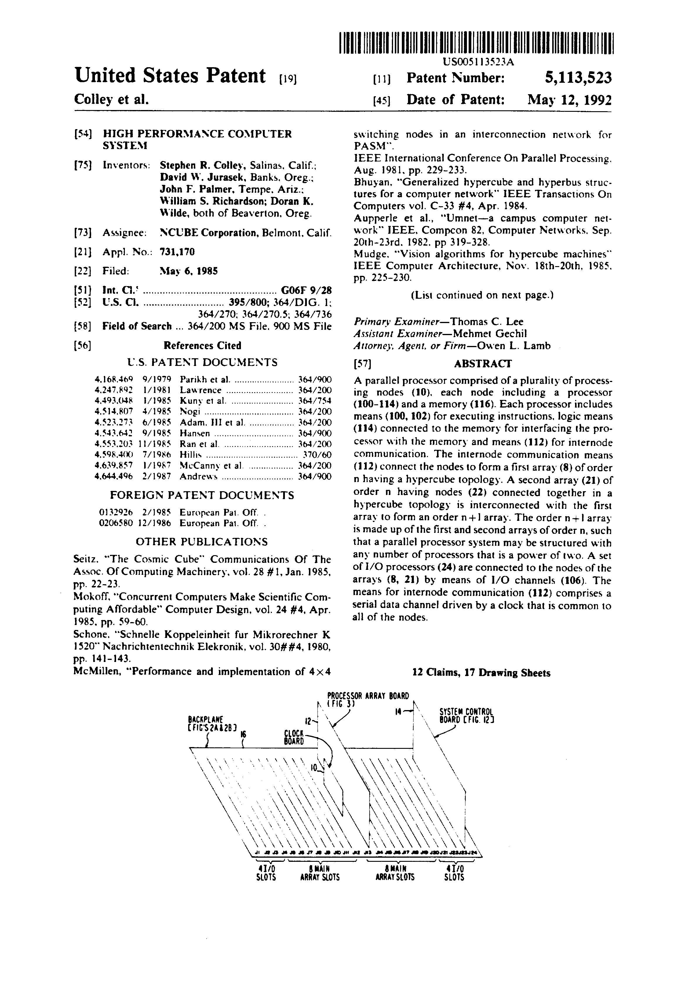
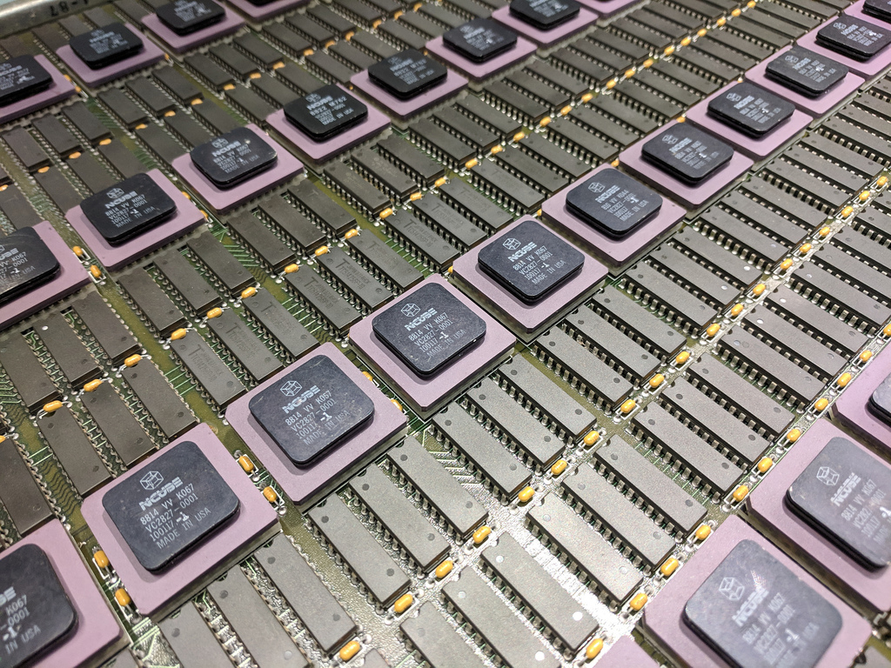

This is a re-typeset version of the nCube patent, [US5113523A](https://patents.google.com/patent/US5113523).
It is unusual for a patent in that it contains an entire architectural
reference manual for the custom CPU in this early parallel computer.

Due to the length of the document it has been split into these
sections:

## Overview

* [Patent abstract and background](abstract.md)

## Part 1

* [System overview](overview.md) (Sections 1-3)
* [The Processor](processor.md) (Section 4, except 4.7 and 4.8)
* [Instruction set](instructions.md) (Section 4.7 and 4.8)
* [The Software and System Management](software.md) (Section 5-6)
* [Using the System](use.md) (Section 7)

## Part 2

* [Data Processor Implementation](implementation.md) (Section 8.1 - 8.11)
* [Patent Claims and Citations](claims.md) (Section 8.12, Claims and Citations)

## External links
* [More photos](https://www.flickr.com/photos/osr/albums/72157703742799362)
* [nCUBE on wikipedia](https://en.wikipedia.org/wiki/NCUBE)

