# PART II. DATA PROCESSOR IMPLEMENTATION

# 8. MAJOR COMPONENTS


FIG. 1 is a diagram of a multiprocessing system in which the present
invention is embodied. A clock board (10), a number (1 to k) of processor
array boards (12), and a number (1 to x) of system control boards (14),
are plugged into slots (J1-J24) in a backplane (16). The backplane
(shown in FIGS. 2A and 2B) is wired in such a way as to interconnect the
k processors boards into an order P hypercube, where each processor board
has m processor nodes connected in an order n hypercube, and where K=2j,
m=2n, and P=j+n.

One of the processor array boards (12) is shown in more detail in FIG. 3,
and is described in Section 8.1. One of the system control boards (14)
is shown in FIG. 12, and is described in Section 8.9.

## 8.1 Processor Array Board

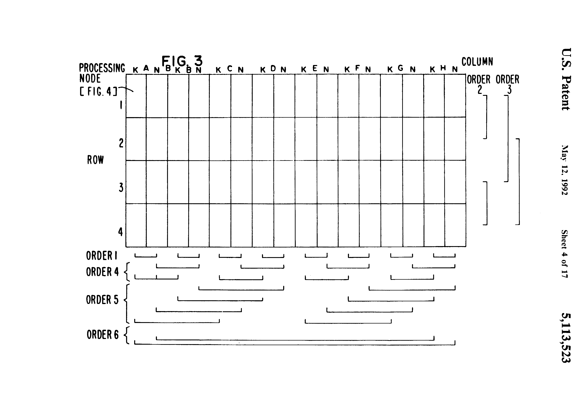

Refer to FIG. 3. Each processor array board is 16" by 21" and contains 64
processing nodes (i.e., m=64) each processing node having 128K bytes of
local memory and 11 I/O channels. The processing nodes are connected in
an order 6 hypercube on the board (i.e. n=6). This interconnection uses 6
of the 11 I/O channels on each processing node. The other 5 I/O channels
are brought to the edge of the board for access to the backplane. 4
of these 5 channels are routed via backplane interconnections to other
array boards to build larger hypercubes as described in Section 8.2 below.

The remaining one channel on each processing node is connected to one
of the eight I/O slots in the backplane which receive eight system
control boards. Thus each one of the eight system control boards (14)
in the I/O slots of FIG. 1 is able to communicate directly with up to
128 processing nodes.

One of the 64 processing nodes on the processor array board of FIG. 3 is
shown in FIG. 4. Each one of the 64 processing nodes includes an Ncube™
processor integrated circuit (30), a local memory (32), a system host
serial I/O channel (34), and 10 (i.e., p=10) serial I/O channels (36). The
wiring on the processor array board (shown in FIG. 3), interconnects
the 64 nodes on the board in an order 6 (n) hypercube comprised of 64
(2n =m) processing nodes. In the illustrative embodiment shown, the
wiring utilizes 6 (n) of the 10 (p) serial interconnect channels to
effect the interconnections among the nodes.

The Ncube™ processor block (30) of FIG. 4 is shown in more detail in
FIG. 5, and is comprised of Floating Point Unit (40), Address Unit and
Instruction Cache (42), Instruction Decoder (44), Integer Execution Unit
(46), I/O Ports (48), and Memory Interface (50), which are attached to
either or both of a common address bus (52), and data bus (54). These
units are described in sections 8.3 through 8.8 below.

## 8.2 Backplane Interconnections

FIG. 2a is a detailed diagram of the arrangement of the serial
communications interconnect on the backplane of the multiprocessing
system shown in FIG. 1. Processor array boards are inserted into one or
more of the 16 slots 0 through F to form hypercube structures according
to the following list:

* 1 board=order 6 hypercube (64 nodes)
* 2 boards=order 7 hypercube (128 nodes)
* 4 boards=order 8 hypercube (256 nodes)
* 8 boards=order 9 hypercube (512 nodes)
* 16 boards=order 10 hypercube (1024 nodes).

The backplane wiring routes signal lines to connect groups of boards
together as shown in FIG. 2A. For example, an order 7 hypercube is
achieved by inserting 2 boards in slots 0 and 1, or 2 and 3, or 4 and 5,
etc. An order 8 hypercube is achieved by inserting 4 boards in slots
0 through 3 or 4 through 7, etc. An order 9 hypercube is achieved by
inserting 8 boards in slots 0 through 7 or 8 through 15. An order 10
hypercube is achieved by inserting 16 boards in slots 0 through 15.

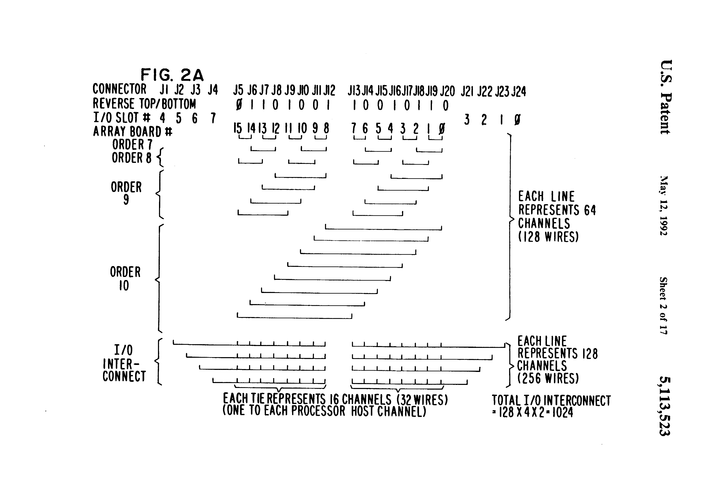

The I/O interconnect wires are shown at the bottom of FIG. 2A. Each
line includes 128 I/O channels which are connected from a system control
board in an I/O slot and fan out to up to 8 processor array boards, 16
channels going to one of the 8 boards. Each one of the 16 channels go
to the host serial channel (34), FIG. 4, on a processing node. Since
there are a total of 64 such nodes on a processor array board, four
system control boards in I/O slots 0 through 3 of FIG. 2A provide the
64 channels on each processor array board in array board slots 0-7,
and four system control boards in I/O slots 4-7 of FIG. 2A provide the
64 channels on each processor array board in array board slots 8-15.

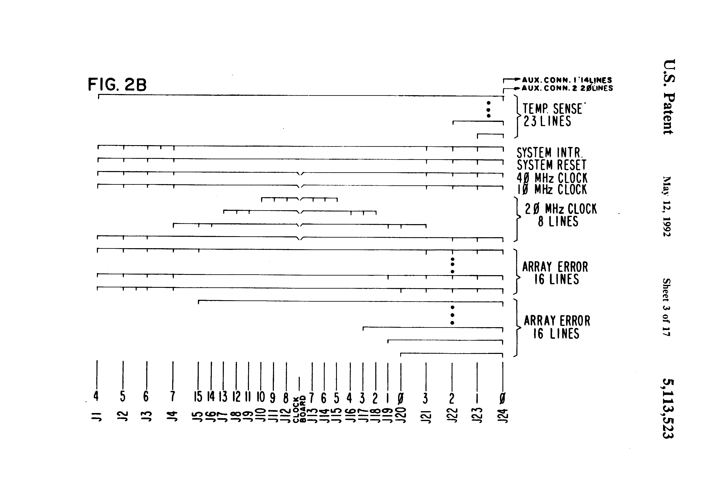

FIG. 2b is a detailed diagram of the system control interconnect on the
backplane of the multiprocessing system shown in FIG. 1. The control lines
include system reset lines, clock lines, and array error lines. As shown,
the clock board (10) of FIG. 1 is inserted in a slot between slots J12
and J13.

## 8.3 Floating Point Unit

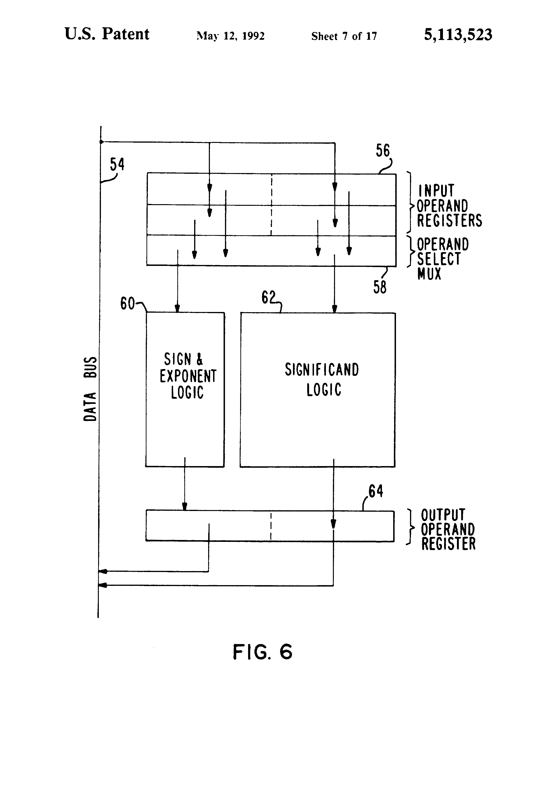

Refer to FIG. 6. The floating point unit (40) shown in FIG. 5 is
comprised of four input operand registers (56) which receive data
from the data bus (54). The operand select MUX (58) selects, from the
appropriate input operand register, the sign and exponent portion and
the significand portion. The sign and exponent portion is delivered to
the sign and exponent logic (60). The significand portion is delivered
to the significand logic (62). The logic blocks (60, 62) perform the
floating point arithmetic specified by the instruction definition in
Section 4.8. The sign and exponent logic (60) and the significand logic
(62) outputs are connected to the operand register (64) which returns
the data to the data bus (54).

## 8.4 Address Unit and Instruction Cache

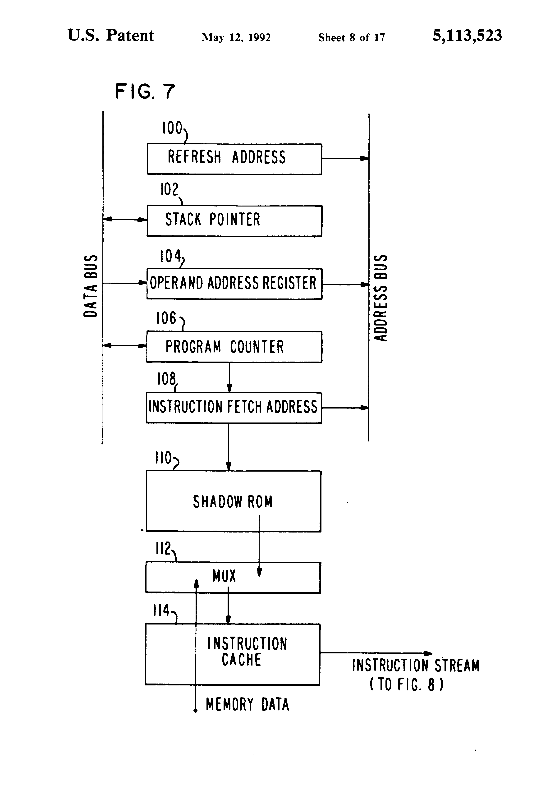

Refer to FIG. 7 which is a detailed block diagram of the address unit
and instruction cache (42) shown in FIG. 5.

The refresh address register (100) contains a pointer to memory which is
the value of the address in memory which is to be refreshed next. After
each refresh cycle is taken, this pointer is incremented. The Stack
Pointer Register (102) contains a pointer which points to the top of the
stack. The stack pointer register is described in Section 4.2.2 above,
under General Registers. The operand address register (104) is an internal
register to which computed effective addresses are transferred before
a memory cycle is performed. The operand address register is connected
to the address bus.

The program counter (106) points to the next instruction to be
executed. It is incremented the appropriate number of bytes after the
instruction is executed. It is also affected by call, return, and branch
instructions which change the execution flow.

The program counter is connected to the instruction fetch address register
(108) which is a pointer into the memory location from which instructions
are currently being fetched. These instructions are loaded into the
instruction cache (114). The instruction cache allows for fetching
several instructions ahead of the instruction that is being executed.

The shadow ROM (110) is described in Section 4.9. It contains instructions
that are executed prior to the transfer of control to user code upon
system initialization. The instruction cache provides a buffer for data
prefetch and before the actual execution of the stored instruction. It
also provides some retention of the data after it has been executed. If
a branch is taken back to a previous instruction for reexecution, and if
that previous instruction is in within 16 bytes of the currently executing
instruction, the data corresponding to that previous instruction will
still be stored in the cache. Thus, a memory fetch cycle will not have
to be taken. The instruction cache is both a look-ahead and look-behind
buffer.

The MUX (112) is a multiplexer that multiplexes between instructions
coming from the shadow ROM or coming from memory after initialization.

## 8.5 Instruction Decoder

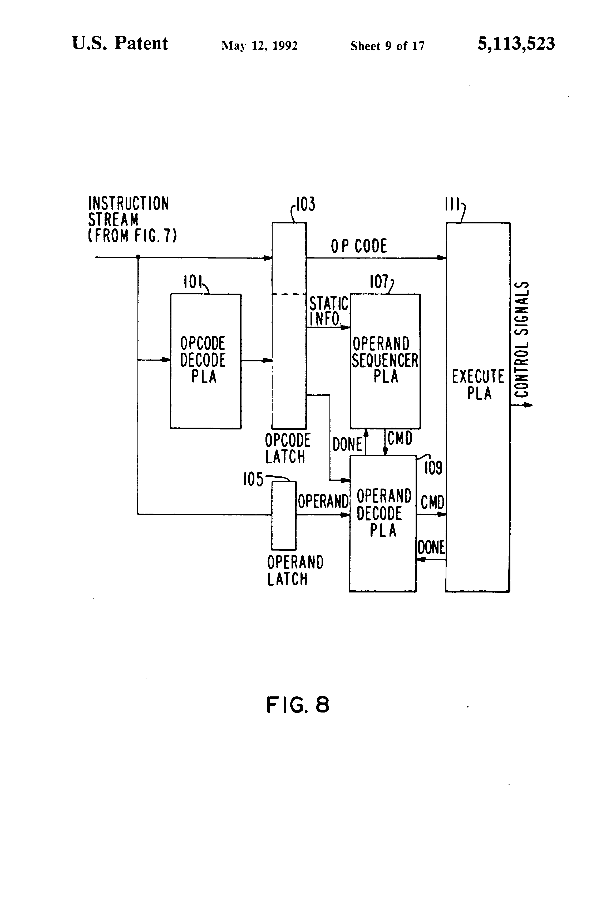

Refer to FIG. 8. The instruction decoder (44) shown in FIG. 5 receives
an instruction stream from the instruction cache of FIG. 7.


The instruction decoder includes an opcode PLA (101) which decodes
static information in connection with the opcode of an instruction,
such as number of operands, type of operands, whether the instruction
is going to take a single cycle to execute or many cycles to execute,
and what unit the instruction is going to execute in (the instruction
execution unit or the floating point unit). This information is latched
in the opcode latch (103). The operand itself is latched into the operand
latch (105). The operand sequencer PLA (107) is a state machine whose
main function is to supervise the decoding of operands. The operand
decode PLA (109) is a state machine whose main function is to compute
effective addresses for each of the addressing modes and to supervise
the execution of instructions. The execute PLA (111) is a state machine
whose main function is to execute the instruction in conformance with
the definition of instructions as given in Section 4.8 above.

## 8.6 Integer Execution Unit

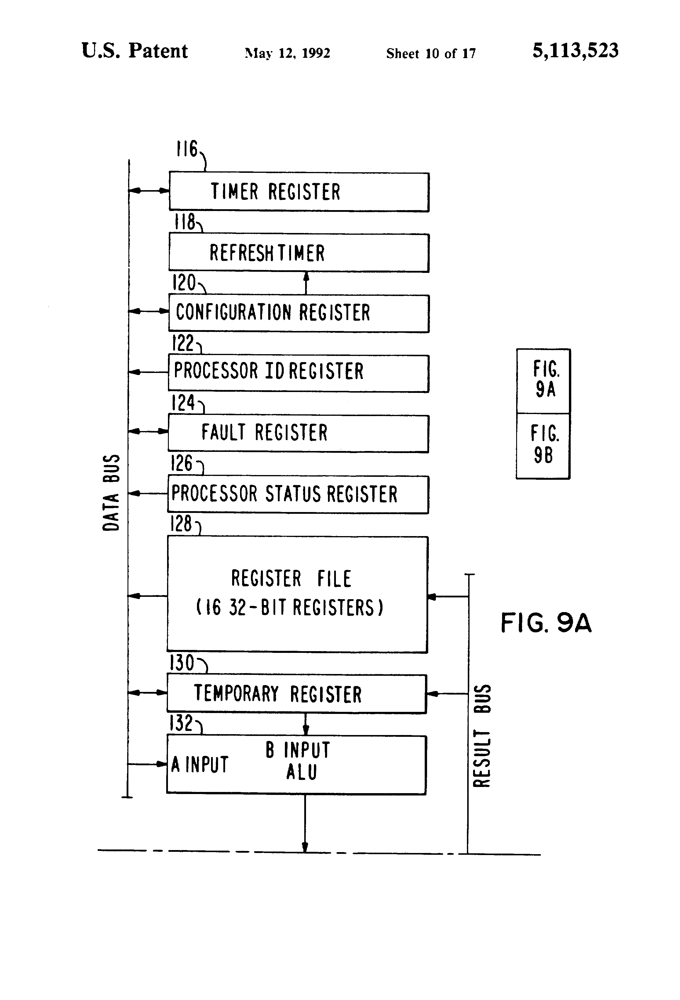

Refer to FIGS. 9A and 9B which together comprise a detailed block diagram
of the integer execution unit shown in FIG. 5. The exact formats and
detailed descriptions of the registers are given in section 4.4.3. The
Processor Status Register (126) contains flags, interrupt controls and
other status information. The Fault Register (124) stores the fault
codes. The Configuration Register (120) stores the model number (read
only) and the memory interface parameters. The Processor Identification
register (122) contains a number that identifies the processor's
location in the array. The Timer register (116) contains a counter that
is decremented approximately every 100 microseconds and generates an
interrupt (if enabled) when it reaches zero.

The refresh timer (118) is a time-out register used to time the period
between refreshes. This register is initialized from eight bits out of
the configuration register and it decrements those eight bits. When the
timer goes to zero, a refresh is requested.

The register file (128) is described in Section 4.4.1 above. It includes
16 addressable registers that are addressable by the instruction operands.

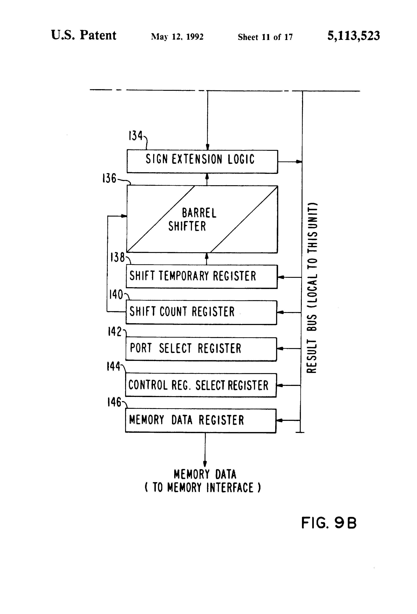

The temporary register (130) is an internal register used during the
execution of instructions. It is connected to the integer ALU (132) which
is used during the execution of integer instructions. The sign extension
logic (134) takes the result from the ALU block and, according to the
data type of the result, extends the sign to a full 32-bit width. It
also checks for conversion overflows.

The barrel shifter (136), the shift temporary register (134), and the
shift count register (140) are used to execute the shift and rotate
instructions. The port select register (142) is an internal register in
which the register number of the serial I/O port to be selected for the
next operation is stored.

The control register select register (144) is an internal register
in which the address of the control register to be selected for the
next operation is stored. The memory data register (146) is an internal
register used for the temporary storage of data which is destined to be
written into memory. It is an interface register between the instruction
execution unit and the memory interface.

## 8.7 I/O Ports


FIGS. 10A and 10B comprise a composite block diagram of a single I/O
port representative of one of the 11 I/O ports (48) on each processor
shown in FIG. 5. Each port has all the circuitry necessary to both
receive and transmit serial messages. The format of the messages is
described in Section 5.4.1 above. Data are received on the serial data
in line (150) and are framed in the input shift register (152). The
information is then transferred in parallel to the input latch (154)
and is stored there until it is transferred to the memory on the memory
data in lines (156). Similarly, data to be transmitted is brought in
from the memory data out-lines (158), stored in the output latch (160),
and then transferred to the output shift register (162), and transmitted
serially on the serial out line and combined with parity bits from the
parity-bit generator (164). The input port and the output port both
contain an address pointer and a byte counter. The address pointers
(166, 170) point to the locations in memory where the message will be
written to or read from.

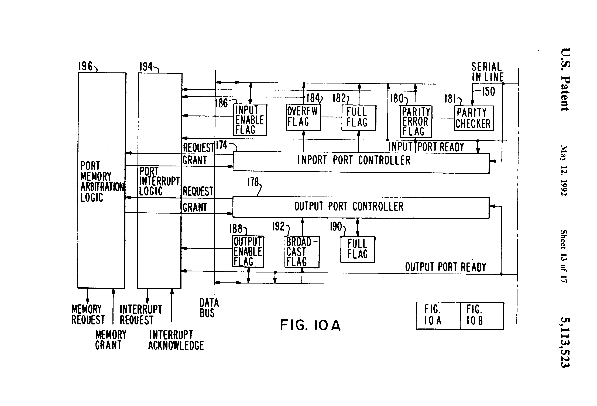

The input and output byte counters (168, 172) are utilized to specify
the length of message to be sent or received. All of these four registers
are initialized by the appropriate instruction: the load address pointer
instruction, and the load byte counter instruction. After a message
packet is received, the input address pointer (166) is incremented by
two bytes and the input byte counter (168) is decremented by the two
bytes. After a message packet has been sent, the output address pointer
(170) is incremented by two bytes and the output byte counter (172)
is decremented by two bytes.

The control portion of the serial port is shown in FIG. 10A. There is
an input controller (174) and an output controller (178) which control
the timing of the serial transmission. These controllers control the
timing of when the parity bits is sent out and when the parity bits is
to be checked on incoming data. They also control the various flags. The
parity error flag (180) is set by the input controller when there is a
parity error detected on an input message. The full flag (182) is set
by the input controller during the time that the input latch (154) is
buffering a message which has not yet been transferred into memory. The
overflow flag (184) is set by the input controller when the input latch is
holding a message to be sent to memory and the input shift register (152)
finishes receiving a second message which overrides the first message
before it is transferred to memory. The input enable flag (186) is a flag
which is both readable and writable by the user to enable interrupts
that occur when the input port becomes ready, i.e. when the byte count
goes to zero. On the output port there is an output enable flag (188)
which, when enabled, will generate an interrupt when the output port
ready line becomes true, i.e., when the byte count goes to zero (when
the message has been fully transmitted). This signals the user that it
is necessary to reinitialize the port with a new message. The full flag
(190) on the output port controller is set for the period of time when
there is data in the output latch which has not been transferred to
the output shift register. The broadcast flag (192) is initialized by
the broadcast count instruction. When this flag is set, it indicates
that this particular output port is a member of the current broadcast
group. When an output port is a member of the current broadcast group,
then any data coming over the memory data out bus (158) for broadcasting
will be transmitted out of this port and simultaneously out of all other
ports that have their broadcast flags on.

The port interrupt logic (194) generates interrupts if enabled when the
input or output ports have finished transmitting or receiving messages,
as signaled by the appropriate byte counter being decremented to zero.

The port memory arbitration logic (196) performs the function of
arbitrating for memory with all the other I/O ports. The winner of this
arbitration must again arbitrate with other units on the chip in the
memory interface unit described in Section 8.8. When an arbitration is
successful and a memory grant is given, the memory grant line indicates
that data either has been taken from the memory data in bus or that the
data is available on the memory data out bus shown in FIG. 10B.

## 8.8 Memory Interface

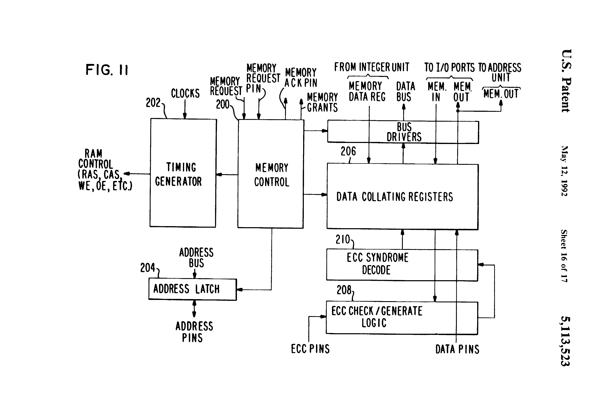

Refer now to FIG. 11, which is a block diagram of the memory interface
logic shown in FIG. 5. The memory interface logic interfaces between
the several internal units which need to access memory and the memory
itself. The memory control block (200) receives the memory request lines
from the various internal parts of the chip and memory requests external
to the chip via the memory request pin. (The memory request pin allows
the Intel 20286 to request a memory cycle of a processor's memory in
which case the memory interfaces logic performs the function of a memory
controller providing the RAM control lines from the timing generator
(202) while allowing the Intel 20286 to actually transfer the data in
and out of the memory).

The memory control prioritizes these requests according to a given
priority scheme and returns memory grants back to the individual
requesting unit when it is that unit's turn to use the memory. The memory
control specifies to the timing generator when access is to begin. The
timing generator provides the precise sequence of RAM control lines as
per the memory specifications for the particular RAM chip. The memory
control also specifies when the address is to be transferred from the
address bus through the address latch (204) to the address pins of the
memory chip. The memory control also controls the transfer of information
from the data collating registers (206) and the internal buses to and
from which data is transferred internally. The data collating registers
(206) perform two functions. First, they bring many pieces of a data
transfer together, for example, for a double-word transfer the registers
will collate the two single words into a double word. Second, the data
collating registers align the data with respect to the memory, such that
if data is being written to an odd location in memory the data collating
registers will skew the data to line up with memory.

The ECC check/generate logic (208) is used to generate the ECC during
a write operation and to check for errors during a read operation. The
ECC syndrome decode (210) operates during a read operation to flag the
bit position that is in error as determined by the ECC check logic. A
single-bit error can be corrected by the error correction code and
this bit position will be corrected automatically by the ECC syndrome
decode logic.

## 8.9 System Control Board


FIG. 12 is a detailed block diagram of the system control board (14)
shown in FIG. 1. It includes an array interface (212), shown in more
detail in FIG. 13, a 2MB System RAM (214), SMD disk drive controller
(216), parallel I/O interface (218), System I/O Interface (220), CPU
and Control (222), Auxiliary I/O Interface (224), and SBX and EPROM (226).

The address buffers (354) and the data buffers (356) are connected via the
data lines and the buffer lines to the local RAM (352). The SMD controller
(216) is connected to the local memory (352) and is also connected to
the system RAM (214) for the transfer of data from disk to memory.

## 8.10 System Array Interface

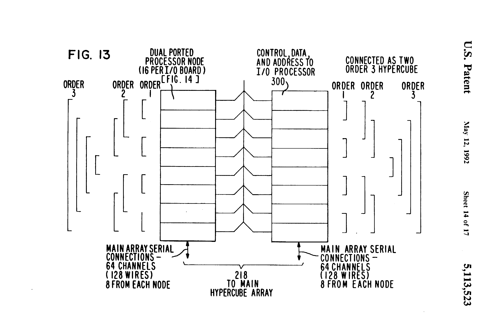

FIG. 13 is a detailed block diagram of the dual-ported processing nodes
and serial communications interconnect on the system control board array
interface shown in FIG. 12. The system control board includes r (r=16)
dual-ported processing nodes (300), connected on the board as shown in
FIG. 13.

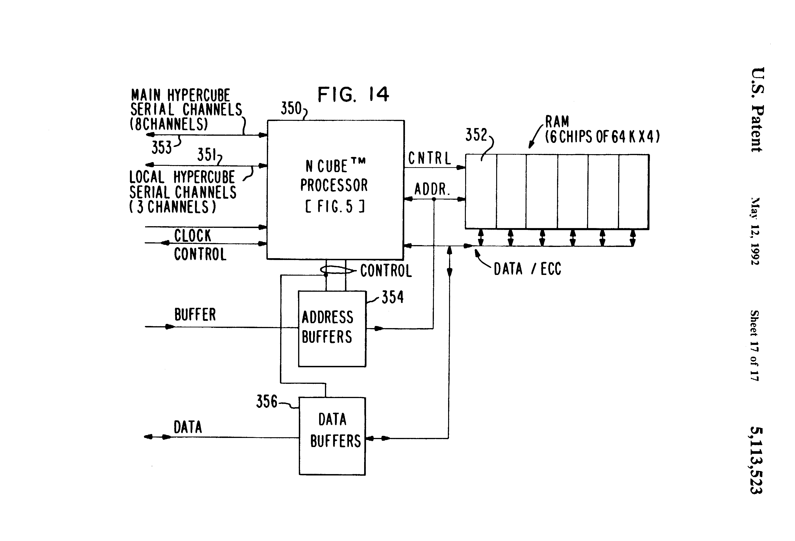

As shown in FIG. 14, each dual-ported processing node includes a processor
(350), a local dual-ported memory (352) and s (s=3) I/O channels. The
channels are interconnected such that the s (s=3) channels (351)
communicate with other nodes on the system control board through the
order 1, order 2 and order 3 interconnect shown in FIG. 13 to form two
order 3 hypercubes. The 16 (r) dual ported processing nodes on an I/O
board are therefore connected as two order 3 hypercubes. The remaining v
(v=8) serial I/O channels (353) communicate with processing nodes on
array boards through host channels in the backplane I/O interconnect
shown in FIG. 2A.

FIG. 14 is a detailed block diagram of one of the 16 dual
ported-processing node of the system control board interface shown in
FIG. 13. The dual-ported processing nodes use the same NCUBE™ processor
integrated circuit as the array processor of FIG. 4.

## 8.11 System Node and Board Addressing

The System Control Boards (14) of FIG. 1 use the 8 I/O slots on the
backplane. Through backplane wiring, these boards are allowed to access
up to a 128 processor node subset of the array. Each System Control Board
(FIG. 13) has 16 processing nodes (300) and each node has 8 of its I/O
channels (0,1,...,7) dedicated to communicating with the Processing
Array through the array interface (212).

Referring to FIG. 1, let each Processor board slot J1-J24 be numbered
(xxxx) in binary. Also assume that the board in that slot contains
the hypercube (xxxx:yyyyyy) where yyyyyy is a binary number that can
range from 0 to 63. (i.e. the ID's of the processors on board xxxx are
xxxxyyyyyy where xxxx is fixed.) Then the following diagram illustrates
the mapping between the nodes in the Main Array and the nodes on a system
control board. ##STR53## Note the following from with respect to the
above chart:

* I/O slots 0,1,2,3 are connected to Processor Array slots 0,1,...,7
and I/O slots 4,5,6,7 are connected to Processor Array slots 8,9,..., 15.

* A node on a System control Board is connected to one processor
on each of the 8 Processor Array Boards that are on its side of the
backplane. Furthermore, the array node numbers that it is connected to
are the same modulo the board number. For example, node 1 on an I/O board
in slot 3 is connected to processors numbered 0xxx000111; or processor 7
(node 7 on Array board 0, processor 71 hex (node 7 on Array board 1, etc).

* A given channel number on all 16 nodes on a System Control Board is
connected to the same Array board. For example, all channels numbered 2
on a System Control Board are connected to processors on Array board 2
if the System Control Board is in slot 0,1,2,3 or 13 if it is in slot
4,5,6,7. By being connected to 128 processing nodes, a system Control
Board has a potential bandwidth of 280 Megabytes/sec.

## 8.12 Variable Meanings in Claims

In the following table, variables are defined for purposes of generic claim language. The actual number for the specific embodiment disclosed in this specification is shown in the table opposite the corresponding variable.

| Variable | Actual Value | Variable Definition |
| -------- | ------------ | ------------------- |
| k  | 16     | number of array boards in system |
| p  | 10     | number of serial channels (excluding host) per processor node. Also order of hypercube of the overall system. |
| m  | 64     | number of processing nodes per array board.
| n  |  6     | order of hypercube on one array board.
| j  |  4     | difference between order of hypercube on an array board and order of hypercube of an overall system; also the number of wires per processing node brought to backplane for purpose of connecting the hypercube. |
| x  |  8     | number of system control boards in system. |
| r  |  16    | number of dual-ported processing nodes per system control board. |
| s  |  3     | number of serial channels per dual-ported processing node, also, order of largest hypercube of dual-ported processing nodes. |
| t  |  2(3)  | order of hypercube on one system control board. |
| u  |  0     | difference between order of hypercube on a system control board and order of hypercube of dual-ported processing of overall system; also the number of wires per dual-ported processing node brought to backplane for purpose of connecting the hypercube. |
| v  |  8     | number of system host channels per dual-ported processing node. |

While the invention has been particularly shown and described with
reference to preferred embodiments thereof, it will be understood by
those skilled in the art that the foregoing and other changes in form
and detail may be made therein without departing from the spirit and
scope of the invention.

## Claims (12)

What is claimed is:
1. A parallel processor comprising in combination:
a plurality of first processing nodes;
a single oscillator clock common to all of said first processing nodes; each of said first processing nodes including a processor and a memory, said memory having data and instructions stored therein, said processor including
(1) executing means for executing said instructions,
(2) fetching means connected to said execution means and to said memory for fetching said instructions from said memory, and,
(3) internode communication means connected to said execution means and to said memory;
said internode communication means comprising an asynchronous I/O channel for fetching data from said memory at an address supplied by said I/O channel and for sending said data to another one of said plurality of first processing nodes, said asynchronous I/O channel being connected to and driven by said single oscillator clock; and,
first means, connected to each of said internode communication means of said first nodes, for interconnecting said first nodes in the structure of a first array of processing nodes, said first array having a hypercube topology.
2. The combination in accordance with claim 1 further comprising:
a system controller;
each of said first processing nodes further including system communication means connected to said execution means for providing system-controller-to-node communication, and,
second means connectedto each of said system communication means of said first nodes for interconnecting said first nodes to said system controller.
3. The parallel processor array in accordance with claim 1 further comprising:
a plurality of second processing nodes, each second processing node including a second-node processor and a second-node memory, said second-node memory having second-node data and second-node instructions stored therein, each of said second processing nodes including
(1) second-node execution means for executing said second-node instructions,
(2) second-node fetching means connected to said second-node execution means and to said second-node memory for fetching said second-node instructions from said second-node memory, and,
(3) second-node internode communication means connected to said second-node execution means and to said second-node memory;
second means, connected to each of said second-node internode communication means, for interconnecting said second nodes in the structure of a second array of processing nodes, said second array having a hypercube topology;
said first and second arrays each being of order n; and,
third means, connected to each of said first and second nodes, for interconnecting said first array and said second array together to form an order n+1 array of which is first and second arrays are a subset, and wherein said order n+1 array is made up of said first and second arrays of order n, such that a parallel processor system is structured with a number of processors that is a power of two.
4. A parallel processor array comprising:
a plurality of array boards (1 to k); a first one of said array boards being comprised of m processing nodes,
each one of said m processing nodes including a memory for storing data and instructions, means for fetching and executing said instructions, and p I/O channels, there being m such nodes on said first one of said array boards;
each of said p I/O channels at each one of said m processing nodes comprising an asynchronous I/O channel for fetching data from said memory to an address supplied by said I/O channel and for sending said data to another one of said m processing nodes; and,
means for interconnecting said m nodes on said first board in an order n hypercube comprised of 2n =n processing nodes;
said interconnecting means utilizing n of the p I/O channels to effectuate the interconnections among said nodes; and,
a backplane;
said backplane including first means for receiving said processor boards;
said backplane including second means for interconnecting said K processors boards in an order P hypercube,
where K=2j,m=2n, and P=j+n.
5. The parallel processor array in accordance with claim 4 wherein each one of said m processing nodes further includes a system host channel, said system host channel being made available at said backplane.
6. A parallel processor array comprising:
a plurality of array boards (1 to k);
a first one of said array boards being comprised of m processing nodes,
each one of said m processing nodes including a local memory for storing data and instructions, means for fetching and executing said instructions, and p I/O channels, there being m such nodes on said first one of said array boards;
means for interconnecting said m nodes on said first board in an order n hypercube comprised of 2n =m processing nodes;
said interconnecting means utilizing n of the p I/O channels to effectuate the interconnections among said nodes;
a backplane;
said backplane including first means for receiving said processor boards;
said backplane including second means for interconnecting said K processors boards in an order P hypercube,
where K=2j, m=2n, and P=J+n;
a plurality of system control boards (1to x);
each one of said system control boards being comprised of r dual-ported processing nodes, each one of said r dual-ported processing nodes including a processor, a local dual-ported memory, a plurality of system host channels (1 to v), and a plurality of I/O channels (1 to s); and,
first means for interconnecting said r dual-reported processing nodes on said system control board in an order t hypercube comprised of 2t =r dual-ported processing nodes on each system control board;
said interconnecting means utilizing t of the s I/O channels to effectuate the interconnections among said nodes;
said backplane including third means for receiving said system control boards;
said backplane including fourth means for interconnecting said x system control boards in an order s hypercube of dual-ported processing anodes, where x=2u, r=2t, and s=t+u;
said v system host channels being made available at said backplane for use in communication with said processing nodes on said array boards.
7. A parallel processor comprising in combination:
a plurality of first process nodes;
a plurality of second processing nodes;
a clock common to all of said first and second processing nodes;
each of said first and second nodes including a processor and a memory, each of said processors including
(1) execution means for executing said instructions,
(2) internode communication means connected to said execution means and to said memory;
said internode communication means comprising a data channel connected to and driven by said clock;
first means, connected to each of said internode communication means of said first nodes, for interconnecting said first nodes in the structure of a first array of processing nodes, said first array having a hypercube topology;
second means, connected to each of said internode communication means of said second nodes, for interconnecting said second nodes in the structure of a second array of processing nodes, said second array having a hypercube topology;
said first and second arrays each being of order n; and,
third means, connected to each of said first and second nodes, for interconnecting said first array and said second array together to form an order n+1 array of which said first and second arrays are a subset, and wherein said order n+1 array is made up of said first and second arrays of order n, such that a parallel processor system is structured with a number of processors that is a power of two;
a first number of unidirectional direct memory access (DMA) output channels connected to said execution means on each of said processors;
a second number of unidirectional direct memory access (DMA) input channels connected to each of said execution means on each of said processor;
each of said DMA channels including two multibit registers, an address pointer register for a message buffer location in memory, and a byte count register indicating the number of bytes left to send or receive;
a first subset of said I/O channels being used for communicating with a host,
a second subset of said I/O channels being used for communicating within said order n+1 array;
each of said I/O channels having an address pointer register, a byte count register, and a "ready" flag;
means for transmitting a messages having a start bit, a message unit, and a parity bit,
said transmitting means including means in said execution means for executing a LPTR (Load Pointer) instruction having a first operand and a second operand,
said LPTR instruction executing means further including means for setting said address pointer register to point to the low byte of the first message unit in said message buffer in said memory,
said first operand of said LPTR instruction being the address of said message buffer and the second operand of said LPTR instruction being an integer whose value determines which of said address registers is to be loaded;
means in said execution means for executing a LCNT (Load Count) instruction having a first operand and a second operand,
said first operand of said LCNT instruction being an integer (the count value) equal to the number of bytes in said message and said second operand being a value that indicates which of said byte count registers is to be loaded;
means operative as each message is sent for incrementing said address register and decrementing said count; and,
means operative upon the condition that said byte count is zero for stopping message transmission, and for setting said ready flag.
8. The combination in accordance with claim 7 further comprising:
means for ensuring that the desired output channels are ready;
means in said execution means for executing a BPTR (Broadcast Pointer) instruction having a first operand and a second operand;
said first operand of said BPTR instruction being the address of a message,
said second operand of said BPTR instruction being a multibit mask in which every bit position of said mask that is set to one enables the corresponding output channel address pointer register to be loaded; and,
means in said processor for executing a BCNT (Broadcast Count) instruction having a first operand and a second operand,
said first operand of said BCNT instruction being the number of bytes in said message and,
said second operand of said BCNT instruction being said multibit mask.
9. The combination in accordance with claim 8 wherein said processor includes means for operating all of said output ports initialized by said BPTR and BCNT instructions in synchronization such that when one output port reads a message unit from said memory, all output ports do so, there being a single message unit read from memory for all of said output ports to transfer out over their respective I/O lines.
10. For use in a parallel processor array comprising a plurality of processor array boards (1 to k), and a clock board having a single oscillator thereon for providing clock lines, said clock lines being driven by said single oscillator,
said processor array boards being comprised of m processing nodes, each one of said m processing nodes including a local memory for storing data and instructions, means for fetching and executing said instructions, and p I/O channels, there being m such nodes on said processor array boards;
each of said p I/O channels at each one of said m processing nodes comprising an asynchronous I/O channel for fetching data from said memory at an address supplied by said I/O channel and for sending said data to another one of said m processing nodes; and, p1 means for interconnecting said m nodes on said processor array board in an order n hypercube comprised of 2n =m processing nodes;
said interconnecting means utilizing n of the p channels to effectuate the interconnections among said nodes,
a backplane comprising:
first means for receiving said K processor array boards;
second means for interconnecting said K processor array boards in an order P hypercube, where n is the order of the hypercube on each of said array boards and where K=2j and P=n+j;
third means for receiving said clock board; and
fourth means for connecting said clock lines to said array boards.
11. For use in a parallel processor array comprising a plurality of processor array boards (1 to k), and a clock board for providing clock lines,
said processor array boards being comprised of m processing nodes, each one of said m processing nodes including a local memory for storing data and instructions, means for fetching and executing said instructions, and p I/O channels, there being m such nodes on said array boards; and,
means for interconnecting said m nodes on said processor array board in an order n hypercube comprised of 2n =m processing nodes;
said interconnecting means utilizing n of the p channels to effectuate the interconnections among said nodes,
a backplane comprising:
first means for receiving said K processor array boards;
second means for interconnecting said K processor array boards in an order P hypercube, where n is the order of the hypercube on each of said array boards and where K=2j and P=n+j;
third means for receiving said clock board;
fourth means for connecting said clock lines to said array boards;
said parallel processor array further including a plurality of system control boards, (1to x)
fifth means for receiving said x system control boards; and,
sixth means for interconnecting said x system control boards into an order s hypercube, where t is the order of the hypercube on each of said system control boards and where x=28 and s=t+u.
12. The backplane as set forth in accordance with claim 13 wherein said processing nodes on said processor array boards each include a system host channel, and wherein said system control boards are comprised of r dual-ported processing nodes, each one of said r dual-ported processing nodes on said system control boards including v system host channels, said backplane further comprising:
seventh means for interconnecting said system host channels on said k array boards to said system host channels on said x system control boards.

```
Patent Citations (12)
Publication number	Priority date	Publication date	Assignee	Title
US4168469A *	1977-10-04	1979-09-18	Ncr Corporation	Digital data communication adapter
US4247892A *	1978-10-12	1981-01-27	Lawrence Patrick N	Arrays of machines such as computers
US4493048A *	1982-02-26	1985-01-08	Carnegie-Mellon University	Systolic array apparatuses for matrix computations
EP0132926A2 *	1983-05-31	1985-02-13	W. Daniel Hillis	Parallel processor
US4514807A *	1980-05-21	1985-04-30	Tatsuo Nogi	Parallel computer
US4523273A *	1982-12-23	1985-06-11	Purdue Research Foundation	Extra stage cube
US4543642A *	1982-01-26	1985-09-24	Hughes Aircraft Company	Data Exchange Subsystem for use in a modular array processor
US4553203A *	1982-09-28	1985-11-12	Trw Inc.	Easily schedulable horizontal computer
US4598400A *	1983-05-31	1986-07-01	Thinking Machines Corporation	Method and apparatus for routing message packets
EP0206580A2 *	1985-06-04	1986-12-30	Thinking Machines Corporation	Method and apparatus for interconnecting processors in a hyper-dimensional array
US4639857A *	1981-08-18	1987-01-27	The Secretary Of State For Defence In Her Britannic Majesty's Government Of The United Kingdom Of Great Britain And Northern Ireland	Digital data processor incorporating an orthogonally connected logic cell array
US4644496A *	1983-01-11	1987-02-17	Iowa State University Research Foundation, Inc.	Apparatus, methods, and systems for computer information transfer
```

Family To Family Citations				
* Cited by examiner, † Cited by third party
Non-Patent Citations (48)
Title
"Report off the Summer Workshop on Parallel Algorithms and Architectures for the Supercomputing Research Center", Aug. 1985.
Aupperle et al., "Umnet--a campus computer network" IEEE, Compcon 82, Computer Networks, Sep. 20th-23rd, 1982, pp 319-328.
Aupperle et al., Umnet a campus computer network IEEE, Compcon 82, Computer Networks, Sep. 20th 23rd, 1982, pp 319 328. *
Barhen, "The hypercube in Robotics and Machine Intelligence" Computers in Mechanical Engineering, Mar.-1986.
Barhen, The hypercube in Robotics and Machine Intelligence Computers in Mechanical Engineering, Mar. 1986. *
Bhuyan, "Generalized hypercube and hyperbus structures for a computer network" IEEE Transactions On Computers vol. C-33 #4, Apr. 1984.
Bhuyan, Generalized hypercube and hyperbus structures for a computer network IEEE Transactions On Computers vol. C 33 4, Apr. 1984. *
C. L. Seitz, "The Cosmic Cube", Comm. ACM, vol. 28, No. 1, Jan. 1985, pp. 22-33.
C. L. Seitz, The Cosmic Cube , Comm. ACM, vol. 28, No. 1, Jan. 1985, pp. 22 33. *
Colley et al. "A Microprocessor-based Hypercube Supercomputer", IEEE Micro, Oct. 1986, pp. 6-17.
Colley et al. A Microprocessor based Hypercube Supercomputer , IEEE Micro, Oct. 1986, pp. 6 17. *
Curnon et al. "A Synthetic Benchmark", Computer J., vol. 19, Feb. 1976, pp. 43-49.
Curnon et al. A Synthetic Benchmark , Computer J., vol. 19, Feb. 1976, pp. 43 49. *
Fox "The Performance of the Caltech Hypercube in Scientific Calculations", Report CALT-68-1298, C.I.T., Pasadena, CA Apr. 1985.
Fox The Performance of the Caltech Hypercube in Scientific Calculations , Report CALT 68 1298, C.I.T., Pasadena, CA Apr. 1985. *
Hayes, "A Microprocessor-based Hypercube Supercomputer" IEEE Micro. Oct. 1986.
Hayes, A Microprocessor based Hypercube Supercomputer IEEE Micro. Oct. 1986. *
IEEE International Conference On Parallel Processing, Aug. 1981, pp. 229 233. *
IEEE International Conference On Parallel Processing, Aug. 1981, pp. 229-233.
M. C. Pease, "The Indirect Binary n-Cube Microprocessor Array", IEEE Trans. Computers, vol. C-26, No. 5, May 1977, pp. 458-473.
M. C. Pease, The Indirect Binary n Cube Microprocessor Array , IEEE Trans. Computers, vol. C 26, No. 5, May 1977, pp. 458 473. *
McMillen, "Performance and implementation of 4×4 switching nodes in an interconnection network for PASM".
McMillen, Performance and implementation of 4 4 switching nodes in an interconnection network for PASM . *
Mokoff, "Concurrent Computers Make Scientific Computing Affordable" Computer Design, vol. 24 #4, Apr. 1985, pp. 59-60.
Mokoff, Concurrent Computers Make Scientific Computing Affordable Computer Design, vol. 24 4, Apr. 1985, pp. 59 60. *
Mudge, "Vision algorithms for hypercube machines" IEEE Computer Architecture, Nov. 18th-20th, 1985, pp. 225-230.
Mudge, Vision algorithms for hypercube machines IEEE Computer Architecture, Nov. 18th 20th, 1985, pp. 225 230. *
Peterson et al. "The Mark III Hypercube--Ensemble Concurrent Processor", Proc. Int'l, Conf. on Parallel Processing, Aug. 1985, pp. 71-73.
Peterson et al. The Mark III Hypercube Ensemble Concurrent Processor , Proc. Int l, Conf. on Parallel Processing, Aug. 1985, pp. 71 73. *
Preparata et al. "The Cube-Connected Cycles: A Versatile Network for Parallel Computation", Comm. ACM. vol. 24, No. 5, May 1981, pp. 300-309.
Preparata et al. The Cube Connected Cycles: A Versatile Network for Parallel Computation , Comm. ACM. vol. 24, No. 5, May 1981, pp. 300 309. *
Report off the Summer Workshop on Parallel Algorithms and Architectures for the Supercomputing Research Center , Aug. 1985. *
Schone, "Schnelle Koppeleinheit fur Mikrorechner K 1520" Nachrichtentechnik Elekronik, vol. 30##4, 1980, pp. 141-143.
Schone, Schnelle Koppeleinheit fur Mikrorechner K 1520 Nachrichtentechnik Elekronik, vol. 30 4, 1980, pp. 141 143. *
Seitz, "The Cosmic Cube" Communications Of The Assoc. Of Computing Machinery, vol. 28 #1, Jan. 1985, pp. 22-23.
Seitz, The Cosmic Cube Communications Of The Assoc. Of Computing Machinery, vol. 28 1, Jan. 1985, pp. 22 23. *
Squire et al. "Physical and Logical Design of a Highly Parallel Computer", tech. note, Dept of E.E., U. of Michigan, Oct. 1962.
Squire et al. "Programming and Design Consideration for a Highly Parallel Computer", AFIPS Conf. Proc., vol. 23, 1963, SJCC, pp. 395-400.
Squire et al. Physical and Logical Design of a Highly Parallel Computer , tech. note, Dept of E.E., U. of Michigan, Oct. 1962. *
Squire et al. Programming and Design Consideration for a Highly Parallel Computer , AFIPS Conf. Proc., vol. 23, 1963, SJCC, pp. 395 400. *
Sullivan et al. "A Large Scale, Homogeneous, Fully Distributed Parallel Machine, I", Proc. 4th Ann. Symp on Computer Architecture, 1977, pp. 105-117.
Sullivan et al. "A Large Scale, Homogeneous, Fully Distributed Parallel Machine, II", Proc. 4th Ann. Symp. on Computer Architecture, 1977, pp. 118-124.
Sullivan et al. A Large Scale, Homogeneous, Fully Distributed Parallel Machine, I , Proc. 4th Ann. Symp on Computer Architecture, 1977, pp. 105 117. *
Sullivan et al. A Large Scale, Homogeneous, Fully Distributed Parallel Machine, II , Proc. 4th Ann. Symp. on Computer Architecture, 1977, pp. 118 124. *
Valiant, "A Scheme for Parallel Communication", SIAM J. Computer, vol. 11, May 1982, pp. 350-361.
Valiant, A Scheme for Parallel Communication , SIAM J. Computer, vol. 11, May 1982, pp. 350 361. *
Weicker, "Dhrystone: A Synthetic Systems Programming Benchmark", Comm. ACM. vol. 27, No. 10, Oct. 1984, pp. 1013-1030.
Weicker, Dhrystone: A Synthetic Systems Programming Benchmark , Comm. ACM. vol. 27, No. 10, Oct. 1984, pp. 1013 1030. *
* Cited by examiner, † Cited by third party
Cited By (123)
Publication number	Priority date	Publication date	Assignee	Title
US5224485A *	1991-05-28	1993-07-06	Hewlett-Packard Company	Portable data acquisition unit
US5260897A *	1990-10-31	1993-11-09	Nec Corporation	Signal processing circuit
WO1994003852A1 *	1992-08-05	1994-02-17	David Sarnoff Research Center, Inc.	Advanced massively-parallel computer apparatus
US5301287A *	1990-03-12	1994-04-05	Hewlett-Packard Company	User scheduled direct memory access using virtual addresses
US5359714A *	1992-01-06	1994-10-25	Nicolas Avaneas	Avan computer backplane-a redundant, unidirectional bus architecture
US5361370A *	1991-10-24	1994-11-01	Intel Corporation	Single-instruction multiple-data processor having dual-ported local memory architecture for simultaneous data transmission on local memory ports and global port
US5367642A *	1990-09-28	1994-11-22	Massachusetts Institute Of Technology	System of express channels in an interconnection network that automatically bypasses local channel addressable nodes
US5367692A *	1991-05-30	1994-11-22	Thinking Machines Corporation	Parallel computer system including efficient arrangement for performing communications among processing node to effect an array transposition operation
US5369773A *	1991-04-26	1994-11-29	Adaptive Solutions, Inc.	Neural network using virtual-zero
US5386510A *	1988-04-29	1995-01-31	Oce-Nederland Bv	Method of and apparatus for converting outline data to raster data
US5428803A *	1992-07-10	1995-06-27	Cray Research, Inc.	Method and apparatus for a unified parallel processing architecture
US5430887A *	1992-10-19	1995-07-04	General Electric Company	Cube-like processor array architecture
US5452401A *	1992-03-31	1995-09-19	Seiko Epson Corporation	Selective power-down for high performance CPU/system
US5490278A *	1991-07-12	1996-02-06	Matsushita Electric Industrial Co., Ltd.	Data processing method and apparatus employing parallel processing for solving systems of linear equations
US5539917A *	1989-11-03	1996-07-23	Compaq Computer Corporation	Computer system having circuitry interfacing a DMA controller directly with a parallel port having specific timing control to allow printing operation without microprocessor intervention
US5555381A *	1989-11-09	1996-09-10	Ast Research, Inc.	Microcomputer architecture utilizing an asynchronous bus between microprocessor and industry standard synchronous bus
US5559973A *	1993-03-31	1996-09-24	Motorola Inc.	Data processing system and method thereof
US5579527A *	1992-08-05	1996-11-26	David Sarnoff Research Center	Apparatus for alternately activating a multiplier and a match unit
US5581778A *	1992-08-05	1996-12-03	David Sarnoff Researach Center	Advanced massively parallel computer using a field of the instruction to selectively enable the profiling counter to increase its value in response to the system clock
US5586289A *	1994-04-15	1996-12-17	David Sarnoff Research Center, Inc.	Method and apparatus for accessing local storage within a parallel processing computer
US5588152A *	1990-11-13	1996-12-24	International Business Machines Corporation	Advanced parallel processor including advanced support hardware
US5590356A *	1994-08-23	1996-12-31	Massachusetts Institute Of Technology	Mesh parallel computer architecture apparatus and associated methods
US5594918A *	1991-05-13	1997-01-14	International Business Machines Corporation	Parallel computer system providing multi-ported intelligent memory
US5598408A *	1990-01-05	1997-01-28	Maspar Computer Corporation	Scalable processor to processor and processor to I/O interconnection network and method for parallel processing arrays
US5603044A *	1995-02-08	1997-02-11	International Business Machines Corporation	Interconnection network for a multi-nodal data processing system which exhibits incremental scalability
US5613138A *	1993-03-17	1997-03-18	Matsushita Electric Industrial Co., Ltd.	Data transfer device and multiprocessor system
US5617577A *	1990-11-13	1997-04-01	International Business Machines Corporation	Advanced parallel array processor I/O connection
US5625836A *	1990-11-13	1997-04-29	International Business Machines Corporation	SIMD/MIMD processing memory element (PME)
US5630162A *	1990-11-13	1997-05-13	International Business Machines Corporation	Array processor dotted communication network based on H-DOTs
US5630135A *	1993-06-04	1997-05-13	Hitachi, Ltd.	Multiple-execution method of multiple-version programs and computer system therefor
US5664192A *	1994-12-14	1997-09-02	Motorola, Inc.	Method and system for accumulating values in a computing device
US5675823A *	1995-08-07	1997-10-07	General Electric Company	Grain structured processing architecture device and a method for processing three dimensional volume element data
US5680536A *	1994-03-25	1997-10-21	Tyuluman; Samuel A.	Dual motherboard computer system
US5708836A *	1990-11-13	1998-01-13	International Business Machines Corporation	SIMD/MIMD inter-processor communication
US5710935A *	1990-11-13	1998-01-20	International Business Machines Corporation	Advanced parallel array processor (APAP)
US5710938A *	1995-07-19	1998-01-20	Unisys Corporation	Data processing array in which sub-arrays are established and run independently
US5717944A *	1990-11-13	1998-02-10	International Business Machines Corporation	Autonomous SIMD/MIMD processor memory elements
US5717884A *	1996-02-02	1998-02-10	Storage Technology Corporation	Method and apparatus for cache management
US5734921A *	1990-11-13	1998-03-31	International Business Machines Corporation	Advanced parallel array processor computer package
US5748489A *	1994-11-30	1998-05-05	International Business Machines Corporation	Parallel execution of a complex task partitioned into a plurality of entities
US5765015A *	1990-11-13	1998-06-09	International Business Machines Corporation	Slide network for an array processor
US5765012A *	1990-11-13	1998-06-09	International Business Machines Corporation	Controller for a SIMD/MIMD array having an instruction sequencer utilizing a canned routine library
US5774693A *	1996-02-28	1998-06-30	Kaimei Electronic Corp.	Multiprocessor parallel computing device for application to the execution of a numerical simulation software program
US5794059A *	1990-11-13	1998-08-11	International Business Machines Corporation	N-dimensional modified hypercube
US5802289A *	1992-12-21	1998-09-01	Apple Computer, Inc.	Method for propagating preemptive bus initialization on an acyclic directed graph
US5802340A *	1995-08-22	1998-09-01	International Business Machines Corporation	Method and system of executing speculative store instructions in a parallel processing computer system
US5805915A *	1992-05-22	1998-09-08	International Business Machines Corporation	SIMIMD array processing system
US5805890A *	1995-05-15	1998-09-08	Sun Microsystems, Inc.	Parallel processing system including arrangement for establishing and using sets of processing nodes in debugging environment
US5809292A *	1990-11-13	1998-09-15	International Business Machines Corporation	Floating point for simid array machine
US5815723A *	1990-11-13	1998-09-29	International Business Machines Corporation	Picket autonomy on a SIMD machine
US5822608A *	1990-11-13	1998-10-13	International Business Machines Corporation	Associative parallel processing system
US5828894A *	1990-11-13	1998-10-27	International Business Machines Corporation	Array processor having grouping of SIMD pickets
US5859981A *	1995-07-12	1999-01-12	Super P.C., L.L.C.	Method for deadlock-free message passing in MIMD systems using routers and buffers
US5892941A *	1997-04-29	1999-04-06	Microsoft Corporation	Multiple user software debugging system
US5903771A *	1996-01-16	1999-05-11	Alacron, Inc.	Scalable multi-processor architecture for SIMD and MIMD operations
US5935216A *	1989-03-01	1999-08-10	Sandia Corporation	Methods for operating parallel computing systems employing sequenced communications
US5958071A *	1995-04-11	1999-09-28	Hitachi, Ltd.	Method and system for controlling parallel execution of jobs
US5963745A *	1990-11-13	1999-10-05	International Business Machines Corporation	APAP I/O programmable router
US5963746A *	1990-11-13	1999-10-05	International Business Machines Corporation	Fully distributed processing memory element
US5966528A *	1990-11-13	1999-10-12	International Business Machines Corporation	SIMD/MIMD array processor with vector processing
US6188874B1 *	1997-06-27	2001-02-13	Lockheed Martin Corporation	Control and telemetry signal communication system for geostationary satellites
US6275893B1 *	1998-09-14	2001-08-14	Compaq Computer Corporation	Method and apparatus for providing seamless hooking and intercepting of selected kernel and HAL exported entry points in an operating system
US6393590B1 *	1998-12-22	2002-05-21	Nortel Networks Limited	Method and apparatus for ensuring proper functionality of a shared memory, multiprocessor system
US6408346B1 *	1989-11-03	2002-06-18	Compaq Computer Corporation	System for communicating with an external device using a parallel port with DMA capabilities and for developing a signal to indicate the availability of data
US6449730B2	1995-10-24	2002-09-10	Seachange Technology, Inc.	Loosely coupled mass storage computer cluster
US20020169941A1 *	2001-05-10	2002-11-14	Eustis Mary Susan Huhn	Dynamic processing method
US20030046482A1 *	2001-08-28	2003-03-06	International Business Machines Corporation	Data management in flash memory
US6571349B1	1995-10-24	2003-05-27	Seachange Technology, Inc.	Loosely coupled mass storage computer cluster
US6615281B1	2000-05-05	2003-09-02	International Business Machines Corporation	Multi-node synchronization using global timing source and interrupts following anticipatory wait state
US6684343B1 *	2000-04-29	2004-01-27	Hewlett-Packard Development Company, Lp.	Managing operations of a computer system having a plurality of partitions
US6721943B2 *	2001-03-30	2004-04-13	Intel Corporation	Compile-time memory coalescing for dynamic arrays
US6725317B1 *	2000-04-29	2004-04-20	Hewlett-Packard Development Company, L.P.	System and method for managing a computer system having a plurality of partitions
US20040123291A1 *	2002-12-12	2004-06-24	Jack Ambuel	Deterministic real time hierarchical distributed computing system
US20040181649A1 *	1995-12-19	2004-09-16	David Bistry	Emptying packed data state during execution of packed data instructions
US20050132129A1 *	2001-08-28	2005-06-16	International Business Machines Corporation	Data management in flash memory
US6973559B1 *	1999-09-29	2005-12-06	Silicon Graphics, Inc.	Scalable hypercube multiprocessor network for massive parallel processing
US20060259529A1 *	2005-04-22	2006-11-16	Wood Paul B	Array of Data Processing Elements with Variable Precision Interconnect
US20070168695A1 *	2006-01-19	2007-07-19	International Business Machines Corporation	Method and apparatus for re-utilizing partially failed resources as network resources
US20070242074A1 *	1999-04-09	2007-10-18	Dave Stuttard	Parallel data processing apparatus
US20070250728A1 *	2006-04-20	2007-10-25	Nvidia Corporation	Work Based Clock Management for Display Sub-System
US20080010436A1 *	1999-04-09	2008-01-10	Dave Stuttard	Parallel data processing apparatus
US20080008393A1 *	1999-04-09	2008-01-10	Dave Stuttard	Parallel data processing apparatus
US20080040385A1 *	2002-11-01	2008-02-14	Bluearc Uk Limited	Apparatus and Method for Hardware-Based File System
US20080162875A1 *	1999-04-09	2008-07-03	Dave Stuttard	Parallel Data Processing Apparatus
US20080162874A1 *	1999-04-09	2008-07-03	Dave Stuttard	Parallel data processing apparatus
US7509533B1 *	2003-06-30	2009-03-24	Sun Microsystems, Inc.	Methods and apparatus for testing functionality of processing devices by isolation and testing
US7552310B1 *	2001-03-28	2009-06-23	Swsoft Holdings, Ltd.	Virtualization and hosting service platform system and method
US20090172363A1 *	2007-12-27	2009-07-02	Doron Orenstien	Mixing instructions with different register sizes
US20090182984A1 *	2008-01-11	2009-07-16	International Business Machines Corporation	Execute Relative Long Facility and Instructions Therefore
US20090182992A1 *	2008-01-11	2009-07-16	International Business Machines Corporation	Load Relative and Store Relative Facility and Instructions Therefore
US20090182985A1 *	2008-01-11	2009-07-16	International Business Machines Corporation	Move Facility and Instructions Therefore
US20090182988A1 *	2008-01-11	2009-07-16	International Business Machines Corporation	Compare Relative Long Facility and Instructions Therefore
US20090182942A1 *	2008-01-11	2009-07-16	International Business Machines Corporation	Extract Cache Attribute Facility and Instruction Therefore
US20090182979A1 *	2008-01-11	2009-07-16	International Business Machines Corporation	Computer Configuration Virtual Topology Discovery and Instruction Therefore
US20090228683A1 *	1999-04-09	2009-09-10	Clearspeed Technology Plc	Parallel data processing apparatus
US7721282B1 *	2004-12-30	2010-05-18	Panta Systems, Inc.	Block-level I/O subsystem for distributed application environment management
US7739434B2	2008-01-11	2010-06-15	International Business Machines Corporation	Performing a configuration virtual topology change and instruction therefore
US7802079B2	1999-04-09	2010-09-21	Clearspeed Technology Limited	Parallel data processing apparatus
US7804862B1 *	2004-05-25	2010-09-28	Qlogic, Corporation	Token ID mechanism for network data transfer
US7895419B2	2008-01-11	2011-02-22	International Business Machines Corporation	Rotate then operate on selected bits facility and instructions therefore
US7925861B2	1999-04-09	2011-04-12	Rambus Inc.	Plural SIMD arrays processing threads fetched in parallel and prioritized by thread manager sequentially transferring instructions to array controller for distribution
US7937606B1	2006-05-18	2011-05-03	Nvidia Corporation	Shadow unit for shadowing circuit status
US7966475B2	1999-04-09	2011-06-21	Rambus Inc.	Parallel data processing apparatus
US8041735B1	2002-11-01	2011-10-18	Bluearc Uk Limited	Distributed file system and method
US8171263B2	1999-04-09	2012-05-01	Rambus Inc.	Data processing apparatus comprising an array controller for separating an instruction stream processing instructions and data transfer instructions
US8169440B2	1999-04-09	2012-05-01	Rambus Inc.	Parallel data processing apparatus
US8180897B2	1999-10-14	2012-05-15	Bluearc Uk Limited	Apparatus and method for hardware implementation or acceleration of operating system functions
US20120182888A1 *	2011-01-18	2012-07-19	Saund Gurjeet S	Write Traffic Shaper Circuits
US20120198213A1 *	2011-01-31	2012-08-02	International Business Machines Corporation	Packet handler including plurality of parallel action machines
US8332844B1	2004-12-30	2012-12-11	Emendable Assets Limited Liability Company	Root image caching and indexing for block-level distributed application management
US8744602B2	2011-01-18	2014-06-03	Apple Inc.	Fabric limiter circuits
US8762691B2	1999-04-09	2014-06-24	Rambus Inc.	Memory access consolidation for SIMD processing elements using transaction identifiers
US8804764B2	2010-12-21	2014-08-12	International Business Machines Corporation	Data path for data extraction from streaming data
US9280480B2	2008-01-11	2016-03-08	International Business Machines Corporation	Extract target cache attribute facility and instruction therefor
US20160105381A1 *	2012-07-09	2016-04-14	Vmware, Inc.	Distributed virtual switch configuration and state management
Family To Family Citations				
US4805091A *	1985-06-04	1989-02-14	Thinking Machines Corporation	Method and apparatus for interconnecting processors in a hyper-dimensional array
GB2201817A *	1987-02-27	1988-09-07	Massachusetts Inst Technology	Geometry-defining processors
US5050069A *	1987-04-27	1991-09-17	Thinking Machines Corporation	Method and apparatus for simulating m-dimension connection networks in and n-dimension network where m is less than n
GB2206428A *	1987-06-15	1989-01-05	Texas Instruments Ltd	Computer
WO1989004521A1 *	1987-11-10	1989-05-18	Echelon Systems	Multiprocessor intelligent cell for a network which provides sensing, bidirectional communications and control
FR2626091B1 *	1988-01-15	1994-05-06	Thomson Csf	Computer high power and computing device comprising a plurality of computers
TWI397060B *	2008-11-25	2013-05-21	Ind Tech Res Inst	Disk layout method for object-based storage device
US10069674B2	2013-12-12	2018-09-04	International Business Machines Corporation	Monitoring file system operations between a client computer and a file server
* Cited by examiner, † Cited by third party, ‡ Family to family citation
Similar Documents
Publication	Publication Date	Title
Arnold et al.	1993	Splash 2
US4130867A	1978-12-19	Database instruction apparatus for determining a database record type
US4432051A	1984-02-14	Process execution time accounting system
US4084224A	1978-04-11	System of controlling procedure execution using process control blocks
US5754871A	1998-05-19	Parallel processing system having asynchronous SIMD processing
US6151669A	2000-11-21	Methods and apparatus for efficient control of floating-point status register
US4307447A	1981-12-22	Programmable controller
US5995992A	1999-11-30	Conditional truncation indicator control for a decimal numeric processor employing result truncation
US6542985B1	2003-04-01	Event counter
US4369494A	1983-01-18	Apparatus and method for providing synchronization between processes and events occurring at different times in a data processing system
US5752067A	1998-05-12	Fully scalable parallel processing system having asynchronous SIMD processing
Flynn et al.	1996	Parallel architectures
US6275920B1	2001-08-14	Mesh connected computed
US6408382B1	2002-06-18	Methods and apparatus for abbreviated instruction sets adaptable to configurable processor architecture
US5249279A	1993-09-28	Method for controlling disk array operations by receiving logical disk requests and translating the requests to multiple physical disk specific commands
US5655133A	1997-08-05	Massively multiplexed superscalar Harvard architecture computer
US4713750A	1987-12-15	Microprocessor with compact mapped programmable logic array
US5291614A	1994-03-01	Real-time, concurrent, multifunction digital signal processor subsystem for personal computers
US20070245122A1	2007-10-18	Executing an Allgather Operation on a Parallel Computer
US7877582B2	2011-01-25	Multi-addressable register file
US5148547A	1992-09-15	Method and apparatus for interfacing bit-serial parallel processors to a coprocessor
US4044334A	1977-08-23	Database instruction unload
US20080250227A1	2008-10-09	General Purpose Multiprocessor Programming Apparatus And Method
US4025901A	1977-05-24	Database instruction find owner
US5819117A	1998-10-06	Method and system for facilitating byte ordering interfacing of a computer system
Priority And Related Applications
Priority Applications (1)
Application	Priority date	Filing date	Title
US06/731,170	1985-05-06	1985-05-06	High performance computer system
Applications Claiming Priority (4)
Application	Filing date	Title
US06/731,170	1985-05-06	High performance computer system
DE19863687764	1986-04-29	Computer system with high performance.
EP19860105879	1986-04-29	High-performance computer system
DE19863687764	1986-04-29	Computer system with high performance.
Legal Events
Date	Code	Title	Description
1985-05-06	AS	Assignment	
Owner name: NCUBE CORPORATION, A CORP. OF CA.,OREGON

Free format text: ASSIGNMENT OF ASSIGNORS INTEREST;ASSIGNORS:COLLEY, STEPHEN R.;JURASEK, DAVID W.;PALMER, JOHN F.;AND OTHERS;SIGNING DATES FROM 19850422 TO 19850430;REEL/FRAME:004419/0196

Owner name: NCUBE CORPORATION, BEAVERTON, OR., A CORP. OF CA.

Free format text: ASSIGNMENT OF ASSIGNORS INTEREST.;ASSIGNORS:COLLEY, STEPHEN R.;JURASEK, DAVID W.;PALMER, JOHN F.;AND OTHERS;REEL/FRAME:004419/0196;SIGNING DATES FROM 19850422 TO 19850430

1995-09-22	FPAY	Fee payment	
Year of fee payment: 4

1999-09-22	AS	Assignment	
Owner name: TRANSAMERICA BUSINESS CREDIT CORPORATION, ILLINOIS

Free format text: SECURITY AGREEMENT;ASSIGNOR:NCUBE CORPORATION;REEL/FRAME:010247/0886

Effective date: 19990816

1999-11-10	FPAY	Fee payment	
Year of fee payment: 8

2003-11-14	FPAY	Fee payment	
Year of fee payment: 12

2003-11-14	SULP	Surcharge for late payment	
Year of fee payment: 11

2003-11-26	REMI	Maintenance fee reminder mailed	
2004-10-18	AS	Assignment	
Owner name: NCUBE CORPORATION, OREGON

Free format text: RELEASE OF SECURITY AGREEMENT (010247/0886);ASSIGNOR:TRANSAMERICA BUSINESS CREDIT;REEL/FRAME:015259/0575

Effective date: 19991231

2005-02-25	AS	Assignment	
Owner name: BROADBAND MANAGEMENT SOLUTIONS, LLC, PENNSYLVANIA

Free format text: ASSIGNMENT OF ASSIGNORS INTEREST;ASSIGNOR:NCUBE CORPORATION;REEL/FRAME:015788/0821

Effective date: 20041231

2005-03-29	AS	Assignment	
Owner name: BROADBAND ROYALTY CORPORATION, DELAWARE

Free format text: ASSIGNMENT OF ASSIGNORS INTEREST;ASSIGNOR:BROADBAND MANAGEMENT SOLUTIONS, LLC;REEL/FRAME:015962/0696

Effective date: 20050321

2013-01-31	AS	Assignment	
Owner name: ARRIS SOLUTIONS, INC., GEORGIA

Free format text: MERGER;ASSIGNOR:BROADBAND ROYALTY CORPORATION;REEL/FRAME:029729/0828

Effective date: 20110101

2013-05-28	AS	Assignment	
Owner name: BANK OF AMERICA, N.A., AS ADMINISTRATIVE AGENT, IL

Free format text: SECURITY AGREEMENT;ASSIGNORS:ARRIS GROUP, INC.;ARRIS ENTERPRISES, INC.;ARRIS SOLUTIONS, INC.;AND OTHERS;REEL/FRAME:030498/0023

Effective date: 20130417

2015-09-14	AS	Assignment	
Owner name: ARRIS ENTERPRISES, INC., GEORGIA

Free format text: ASSIGNMENT OF ASSIGNORS INTEREST;ASSIGNOR:ARRIS SOLUTIONS, INC.;REEL/FRAME:036601/0162

Effective date: 20150914

2017-03-14	AS	Assignment	
Owner name: ARRIS ENTERPRISES LLC, PENNSYLVANIA

Free format text: CHANGE OF NAME;ASSIGNOR:ARRIS ENTERPRISES INC;REEL/FRAME:041995/0031

Effective date: 20151231

Data provided by IFI CLAIMS Patent Services
