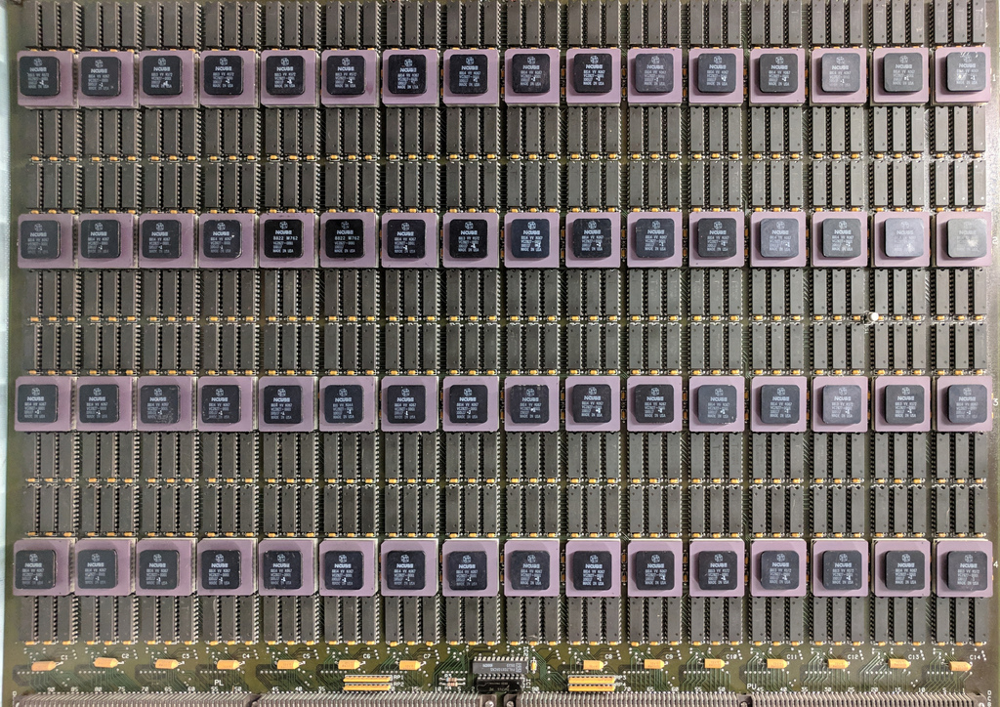
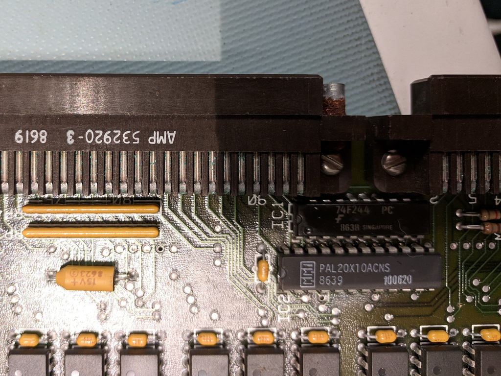
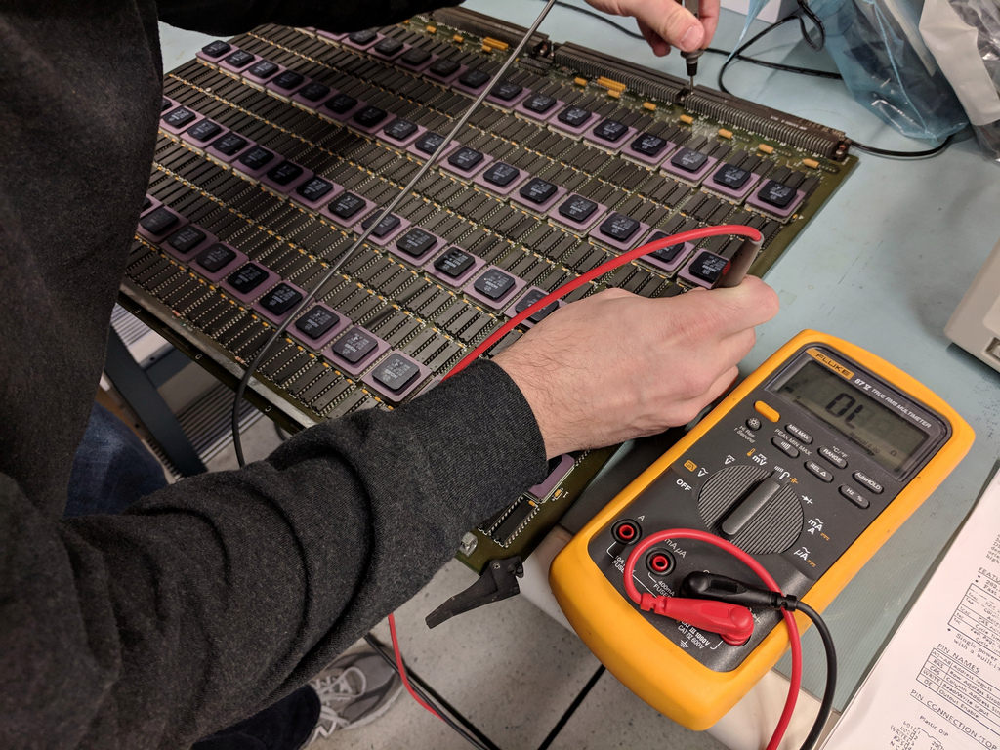

# nCube compute boards

Each board has 64 CPUs, each with six RAM chips (4x64 Kb).  The 24-bit wide
RAM data bus is organized as 16 data bits and 8 ECC bits.  All the CPUs
share a common clock.

Each CPU has 11 serial interconnect lines, and on board the CPUs
are connected in a 6-degree hypercube, leaving 4 outbound links to
other boards and one outbound link to the control board.

There is one transistor and one LED on the board.

The only other active components on the board are a 74F244 octal buffer
and a PAL20X10ACNS.  Probing with a multimeter showed that all of the
buffer inputs are tied together and the enables are grounded. One of the
outputs is connected to the CLK line on the PAL, so we're assuming that
the buffer fans out to all of the CPUs.  We're also assuming that PAL
is doing some sort of reset logic.

# Probing the backplane

The backplane connection is 4x184 pins in four 4x46 blocks.
Since there are 16 CPUs per block and each CPU has 5 serial outputs,
that accounts for 16 * 2 * 5 = 160 pins.

+5V power and ground are ganged together in four adjacent pins, with three of
each.  3 * 2 * 4 = 24 pins.

One of the blocks has two of the power pins replaced with the clock and
likely the reset pin.
