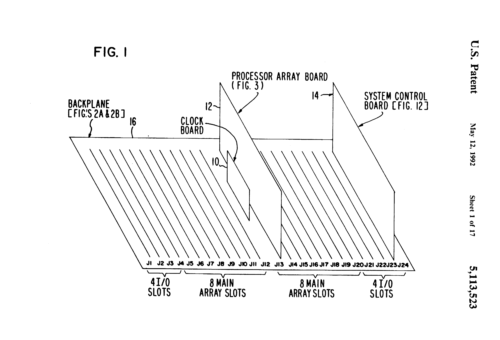
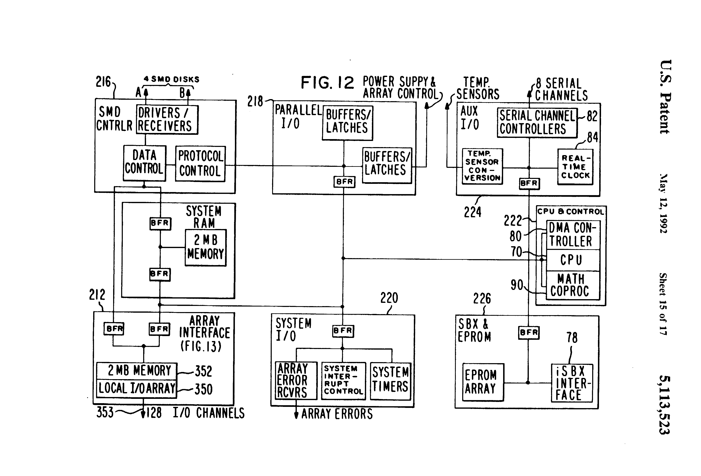

# PART I. DATA PROCESSOR ARCHITECTURE

# 1. References and Definition of Terms

For background information see "The Extension of Object-Oriented Languages
to a Homogeneous, Concurrent Architecture", Thesis by Charles Richard
Lang, Jr., Computer Science Department Technical Report Number 5014,
California Institute of Technology, Pasadena, Calif., May 24, 1982.

The terms, syntax notation, etc., used in this specification conform to
IEEE standards.

Information about Ncube™ products referred to in this specification
can be obtained by writing to Ncube Corporation, 1815 NW 169th Place,
Suite 2030, Beaverton, Or. 97006.

Information about Intel products referred to in this specification can be
obtained by writing to Intel Corporation, 3065 Bowers Ave., Santa Clara,
Calif. 95051.

# 2. INTRODUCTION

The architecture of the system in which the present invention is
embodied uses up to 1024 identical high speed processors (processing
nodes) connected in an array to work on a single problem. Each node is a
general purpose processor with 128K bytes of local ECC memory. There are
8 I/O channels providing input to and output from the processing array.

When a processing node fails the system can continue operation on
a subset of the array with reduced performance thus providing fault
tolerance through graceful degradation in addition to reliability.

The array is interconnected in a recursive topology called a hypercube
(see Section 3.2) that can be divided into subarrays of 64, 128, 256, or
512 processors. The software can easily adjust to the number of processors
in the system. One job can run on the entire array or several jobs can run
at once on subsets of the array. This space sharing avoids the constant
swapping overhead that occurs in conventional time sharing systems.

The modularity of this design enhances extensibility. Simply by rewiring
the backplane, the architecture can support a larger array. Also by
connecting systems together with an interprocessor Link it is possible
to use multiple systems in parallel or as a very powerful pipeline.

# 3. THE SYSTEM

## 3.1 System Overview



One embodiment of a system in which the principles of the present
invention are practiced is described in detail in Part II of this
specification. Briefly, it consists of an air cooled enclosure containing
a backplane with up to 24 boards, a disk/tape subsystem and power
supplies. The backplane (16) shown in FIG. 1 uses 16 slots to support a
processor array of up to 1024 processors, each with 128K bytes of local
memory. The other 8 slots are used for I/O. Each I/O slot is connected
to a different subset of 128 processors in the array.

Each processor node in the processing array has a 1/2 Megaflop (floating
point operations) or 2 MIP (integer operations) processor. Thus a fully
loaded system with 1024 processors has a potential performance of 500
Megaflops or 2000 MIPS. Each I/O bus into the array consists of two
unidirectional data paths (one inbound, one outbound) that operate
independently and in parallel. Each path can transfer data at up to
140 Megabytes/sec.

## 3.2 Hypercube Array Description

The processing array consists of processors with local memory
interconnected in a topology called a hypercube. One way to describe a
hypercube is graphically. Hypercubes of low order can be illustrated as
shown below (circles are nodes and lines are communication links):

```
ORDER       HYPERCUBE GRAPH
N = 0       O
N = 1       O-O
N = 2       O-O
            | |
            O-O
```

Another way to describe the hypercube is by a recursive definition. Each
processor has a label that is a binary number. Two processors are
connected if their labels differ in only one place. The low order
hypercubes are listed below:

```
ORDER       PROCESSOR LABELS
N = 0        0
N = 1        0
             1
N = 2       00
            01
            10
            11
```

From an order (N-1) hypercube it is very simple to define an order N
cube. The (N-1) hypercube will have nodes labeled as shown:

```
0xx...xx
(N-1)
```

First another (N-1) hypercube is constructed with nodes labeled:

```
1xx...xx
(N-1)
```

And then all (N-1) connections between the two (N-1) hypercubes are
made so that every pair of node labels that differ only in their most
significant bit are connected (e.g. 010...01 must be connected to
110...01).

This formulation of the hypercube illustrates two of its most important
properties:

* The number of interconnections per node grows as the Log2 of the
number of processors which allows for more direct interconnections than
most array schemes have.

* An order N hypercube is made of 2 order (N-1) hypercubes. This allows
for several beneficial features

  * the system can be modular since a large array is logically equivalent
to a small one;

  * software can be written for a generic hypercube independently of its
order--the program will simply run faster on a larger array;

  * a large system can be partitioned by the Operating System among
multiple users so that each has a smaller hypercube to run user software.

These advantages are not available in a typical toroidal grid (lattice)
type of interconnection scheme. But since two and three dimensional
grids are very useful in many applications, it is important to note that
a hypercube can be mapped onto either grid simply by ignoring some of
the available communication links.

### 3.2.1 System Control Board

At least one System Clock board (14), shown in FIG. 1, must be installed
in the every system and there can be up to 8 per system. Its primary
purpose is to run the operating system described in section 5.3, including
the cross compilers, assembler and linker and to control a wide range
of peripherals. It uses an Intel 80286 with 4 Megabyte of memory for
the operating software. There are also four sockets for an EPROM that
contains the monitor and diagnostics software described in section 5.2.



In addition to the main Intel 80286 processor running the operating
system, the System Control board has eight RS-232 serial ports and one
high speed printer port. It has the logic to control up to 4 SMD disk
drives and three Intel iSBX multimodule connectors. These multimodule
connectors support options such as tape drive controllers, ethernet
interfaces and interboard buses (for I/O boards). This bus allows for
users attached to different System Control boards to access a common
file system that is spread across several disk drives controlled by
different controllers. A block diagram of the System Control board is
shown in FIG. 12, and is described in detail in section 8.9.

The sections below describe the architecture of the System Control in
more detail.

#### 3.2.1.1 Central Processor

The central processor of the System Control is an Intel 80286. This
is a high performance 16 bit processor that has a compatibility mode
with the Intel 8086. In addition it can address 16 megabytes of memory
and has memory management and protection built into the chip. It is the
host for a multitasking/multiuser operating system. For more details on
programming the Intel 80286 see Intel's iAPX 286 Programmer's Reference
Manual, which can be obtained from Intel Corporation, 3065 Bowers Ave.,
Santa Clara, Calif. 95051.

#### 3.2.1.2 System Programmable Read-Only Memory (PROM)

The System Control has 8 sockets for PROM (72) which may be loaded
with devices from Intel 2764's up to Intel 27512's. The PROM resides at
location F80000 to FFFFFF in the Intel 80286 memory space. Since these
are byte wide devices they are arranged in 2 banks with the following
addresses.

```
CHIP      BANK 1 (top)   BANK 0
2^64      FFC000-FFFFFF  FF8000-FFBFFF
2^128     FF8000-FFFFFF  FF0000-F7FFFF
2^256     FF0000-FFFFFF  FE0000-FEFFFF
2^512     FE0000-FFFFFF  FC0000-FDFFFF
```

The PROM's are programmed by and contain a monitor described in section
5.2, that includes the following functions:

* a bootstrap loader
* a debugger
* a diagnostic package
* an offline system backup/restore facility

#### 3.2.1.3 Global Random Access Memory (RAM)

There are 2 megabytes of global dual ported memory (214) on the System
Control Board shown in FIG. 12. This memory can be directly accessed
by both the Intel 80286 (block 222) and the SMD disk controller (216)
and resides at location 0 to 1FFFF in the system memory space.

#### 3.2.1.4 Local I/O Array

There is a local array interface (212) of 16 processing nodes on the
System Control Board. Each node consists of a processor and 128 Kbytes of
RAM. This memory is triple ported since it can be directly accessed by
the local processor, the Intel 80286 and the SMD disk controller. All
Intel 80286 and disk controller accesses to these local memories
are 16 bits only. The main purpose of this array (214) is to provide
communication (an I/O bus) with the main Processing Array. Thus, 8 of
the 11 channels on each node are dedicated to providing communication
between the Processing Array and the System Control. The nodes on the
System Control board are numbered 0,1,...,15 and their local memory
resides in the Intel 80286 address space according to the table below.

```
Processor Number           Address
0               200000 to 21FFFF
1               220000 to 23FFFF
2               240000 to 25FFFF
3               260000 to 27FFFF
4               280000 to 29FFFF
5               2A0000 to 2BFFFF
6               2C0000 to 2DFFFF
7               2E0000 to 2FFFFF
8               300000 to 31FFFF
9               320000 to 33FFFF
10              340000 to 35FFFF
11              360000 to 37FFFF
12              380000 to 39FFFF
13              3A0000 to 3BFFFF
14              3C0000 to 3DFFFF
15              3E0000 to 3FFFFF
```

Since the local processing nodes on the System Control each have 3
communication channels uncommitted to I/O, they are interconnected in the
two order-3 hypercubes. That is, nodes numbered 0,1,...,7 form one
hypercube and nodes numbered 8,9,...,15 form another hypercube. This
allows users to test their programs on the small hypercubes on the system
control board before loading them into the main array, thus offloading
most debugging tasks. It may appear that since the two hypercubes are
not directly interconnected it would be difficult to move data from a
node in one cube to a node in the other. However, since all the memory
is in the Intel 80286 memory space, it is simple and fast to use the
central processor or the DMA processor to move the data.

#### 3.2.1.5 SBX Connectors

There are three Intel iSBX™ connectors (78) on the system control
board. Intel and other companies make a wide range of small boards
for the SBX I/O bus. There are boards for high speed math, graphics,
tape drive controllers, floppy disk controllers, network controllers,
etc. If a system contains more than one System Control then one of the
SBX connectors on each board is reserved for implementing a local bus
so that the operating system, and particularly the file system, can be
spread over the disk drives controlled by all the System Controls. Thus
a user need not be concerned to which board a terminal is attached.

The devices that are inserted into the SBX connectors appear to a
programmer as locations in the 80286 I/O space that can be read from
and written into. They can also be controlled by the Intel 82258 ADMA
(Advanced Direct Memory Access) chip. The boards can generate interrupts
to the Intel 80286 (for details on interrupts see section 3.3.2.1.10). The
data that is read or written can be either Byte or Halfword and each
SBX connector has 32 reserved I/O addresses (3 bits of address and 2
bits of chip select) as shown below.

```
SBX Connector  I/O Address             Interrupt Vector
1              A0 to AF and B0 to BF   # 82 at 148
2              80 to 8F and 90 to 9F   # 81 at 144
3              60 to 6F and 70 to 7F   # 80 at 140
```

There are two types of SBX devices, 8 bit and 16 bit, but both boards
have the equivalent of two 8 bit registers that are activated by the
chip select bits (MCS0, MCS1). The following table contains the data
transfer details. The Device and Data columns refer to the number of
bits in the device and in the data to be transferred respectively.

```
Device      Data   Registers  Addresses
1   16      16     MCS1,MCS0  A0,A2,A4,A6,A8,AA,AC,AE
    8,16    8      MCS0       A0,A2,A4,A6,A8,AA,AC,AE
    16      8      MCS1       A1,A3,A5,A7,A9,AB,AD,AF
     8      8      MCS1       B0,B2,B4,B6,B8,BA,BC,BE
2   16      16     MCS1,MCS0  80,82,84,86,88,8A,8C,8E
    8,16    8      MCS0       80,82,84,86,88,8A,8C,8E
    16      8      MCS1       81,83,85,87,89,8B,8D,8F
     8      8      MCS1       90,92,94,96,98,9A,9C,9E
3   16      16     MCS1,MCS0  60,62,64,66,68,6A,6C,6E
    8,16    8      MCS0       60,62,64,66,68,6A,6C,6E
    16      8      MCS1       61,63,65,67,69,6B,6D,6F
     8      8      MCS1       70,72,74,76,78,7A,7C,7E
```

#### 3.2.1.6 Printer (Centronics) Port

There is one high speed printer I/O port on the System Control Board. It
supports the Centronics protocol with 8 bits of data and 4 bits of
status. It is intended for a high speed peripheral such as a printer or
plotter. It is in the I/O space of the Intel 80286 at location 14 and
also has DMA capability since it can be controlled by the Intel 82258
ADMA device (80). When accessing this address the system performs the
following functions. (When Reading, bits 12 to 15 yield general system
status, not printer status.)

```
Write I/O Address 14
bits 0-7:   printer data
bits 8-15:  centronics control signals

Read I/O Address 14
bits 0-7:   printer data
bit 8:      1 = printer select
bit 9:      1 = printer paper error
bit 10:     1 = printer fault
bit 11:     1 = printer busy
bit 12:     1 = diagnostic mode, 0 = normal mode
bit 13:     reserved
bit 14:     reserved
bit 15:     1 = main power (-5) good
```

#### 3.2.1.7 Direct Memory Access (DMA) Controller

The System Control Board has an Intel 82258 ADMA device (80) that controls
the Direct Memory Access in the system. It is specifically intended to
control the 3 SBX connectors and the Centronics parallel port. However,
it is a very powerful processor and can control other DMA functions in
the system including moving blocks of data in memory. Refer to Intel's
82258 Manual for details.

The Intel 82258 has 4 DMA channels and each channel has a set of registers
associated with it. Also there is a set of global registers. All of
these registers are in the Intel 80286 I/O address space as shown in
the table below.

```
Global Register    Bits   I/O Addr
----------------------------------
Command (GCR)      16     100
Burst (GBR)         8     106
Status (GSR)       16     102
Delay (GDR)         8     108
Mode (GMR)         16     104
```

```
I/O Addresses
Channel Register                Bits   DMA0  DMA1  DMA2  DMA3
-------------------------------------------------------------
Command Pointer (CPR)           24     10A   12E   152   176
Source Pointer (SPR)            24     10E   132   156   17A
Destination Pointer (DPR)       24     112   136   15A   17E
Translate Table Pointer (TTPR)  24     116   13A   15E   182
List Pointer (LPR)              24     11A   13E   162   186
Byte Count (BCR)                24     11E   142   166   18A
Channel Command (CCR)           24     122   146   16A   18E
Mask (MASKR)                    16     126   14A   16E   192
Compare (COMPR)                 16     128   14C   170   194
Assembly (DAR)                  16     12A   14E   172   196
Channel Status (CSR)             8     12C   150   174   198
```

The Channel Registers can be written by setting the Command Pointer to
point to a command block in memory and then giving the Intel 82258 a
START CHANNEL command from the Intel 80286. The format of the command
block in memory is shown below: ##STR2##

TODO: figure

#### 3.2.1.8 Serial Channels

The System Control Board shown in FIG. 12 has 8 serial channels that are
controlled by four Intel 8530 Serial Communications Controllers (82), each
device handling 2 channels. Each 953- also has two baud rate generators
and interrupt generation logic. There are a set of control (Write)
registers and a set of status (Read) registers for each channel. The
registers are all 8 bits and all accesses are byte only. A summary of
the register functions is listed below (unless noted two copies of each
register exist, one for each channel):

READ REGISTER FUNCTIONS
* RR0: Transmit/Receive buffer status and External status
* RR1: Special Receive Condition status
* RR2: Interrupt Vector Even channels=Unmodified; Odd channels=Modified
* RR10: Receive buffer (Data)
* RR12: Lower byte of baud rate generator time constant
* RR13: Upper byte of baud rate generator time constant
* RR15: External/Status interrupt information

WRITE REGISTER FUNCTIONS
* WRO: Initialization commands for addressing, modes, CRC
* WR1: Transmit/Receive interrupt and data transfer mode definition
* WR2: Interrupt Vector (accessed through either channel) Only one WR2 per 8350
* WR3: Receive parameters and control
* WR4: Transmit/Receive miscellaneous parameters and modes
* WR5: Transmit parameters and controls
* WR6: Sync characters of SDLC address field
* WR7: Sync character or SDLC flag
* WR8: Transmit buffer (Data)
* WR9: Master interrupt control and reset (accessed through either channel)
Only one WR9 per 8350
* WR10: Miscellaneous transmitter/receiver control bits
* WR11: Clock mode control
* WR12: Lower byte of baud rate generator time constant
* WR13: Upper byte of baud rate generator time constant
* WR14: Miscellaneous control bits
* WR15: External/Status interrupt control

The only registers that can be directly addressed in the I/O space of
the Intel 80286 are the two Data registers (RR8 and WR8) and RR0 and
WR0. In order to read or write any other register requires two steps:
(1) write the appropriate code into WR0 then (2) perform the read or
write operation.

After doing this, bits 0 through 4 of WR0 are automatically cleared so
that WR0 points to WR0 or RR0 again. The I/O addresses corresponding to
the 8530 devices and the I/O channels are listed in the table below. Each
channel can generate four interrupts to indicate the conditions: Tx empty,
Status Change, Rx Ready and Special Rx. The interrupt vector addresses
(assuming the given vector bases are used) are also listed below. (To
obtain the interrupt numbers divide the vector address by four.)

```
Device:              SSC 0      SSC 1     SSC 2     SSC 3
Channels:            0    1     2    3    4    5    6    7
I/O Addresses:
Status: RR0 & WR0    D4   D0    DC   D8   E4   E0   EC   E8
Data: RR8 & WR8      D6   D2    DE   DA   E6   E2   EE   EA
Vector Address:
Vector Base:            28         30        38        40
Tx Empty:            A0   B0    C0   D0   E0   F0   100  110
Status Change:       A4   B4    C4   D4   E4   F4   104  114
Rx Ready:            A8   B8    C8   D8   E8   F8   108  118
Special Rx:          AC   BC    CC   DC   EC   FC   10C  11C
```

Each Serial Channel Controller (82) has an integrated baud rate generator
that depends on the setting of a Time Constant, supplied by real-time
clock (84). The equation and a baud rate table are given below.

```
Clock Rate: 1.8432 Mhz
Equation:   Time Constant = (57600 / baud rate) - 2
Table:      Baud Rate    Time Constant
      19200         1
      9600          4
      4800         10
      3600         14
      2400         22
      2000         27
      1800         30
      1200         46
      600          94
      300          190
      150          382
      134.5        426
      110          522
      75           766
      50           1150
```

#### 3.2.1.9 SMD Disk Controller

The System Control has an SMD disk controller unit (216). It is capable
of controlling up to four standard SMD disks drives. Data is accessed
in blocks of 1024 bytes at a rate of 1 Megabyte per second. The disk
controller unit consists of 6 registers in the I/O address space which
are described below.

*  Command/Status Register:

```
I/O Address: 00
Write: Command ##STR3##
Read: Status
  bit 0:  Command bit 0
  bit 1:  Command bit 1
  bit 2:  Command bit 2
  bit 3:  1 = Header Sync Error
  bit 4:  1 = Header Address Error
  bit 5:  1 = Header CRC Error
  bit 6:  1 = Data Sync Error
  bit 7:  1 = Data CRC Error
  bit 8:  1 = Data Overrun/Underrun Error
  bit 9:  1 = Illegal Memory Access
  bit 10: 1 = Controller Ready
  bit 11: 1 = Disk Ready
  bit 12: 1 = Disk Selected
  bit 13: 1 = Seek Error
  bit 14: 1 = Write Error
  bit 15: 1 = Disk Fault
```

*  Control
```
I/O Address: 02
Read and Write
  bit 0: \___ Unit Select
  bit 1: /
  bit 2:  Reserved (must be 0)
  bit 3:  Reserved (must be 0)
  bit 4:  1 = Servo Offset +
  bit 5:  1 = Servo Offset -
  bit 6:  1 = Data Strobe Early
  bit 7:  1 = Data Strobe Late
```

*  Low Memory Address
```
I/O Address: 04
Read and Write (Read may not be valid if controller is busy)
  bit 0:  \
  ...      } Low order part of memory addres
  bit 15: /
```

* High Memory Address
```
I/O Address: 06
Write
  bit 0:  \
  ...      } High order part of memory addres
  bit 7:  /
  bit 8:  \
  ...      } Do Not Care
  bit 15: /
Read
  bit 0:  \
  ...      } High order part of memory addres
  bit 7:  /
  bit 8:  0 = Disk 0 Connected
  bit 9:  0 = Disk 1 Connected
  bit 10: 0 = Disk 2 Connected
  bit 11: 0 = Disk 3 Connected
  bit 12: Reserved
  bit 13: Reserved
  bit 14: Reserved
  bit 15: Reserved
```

*  Head/Sector
```
I/O Address: 08
Read and Write
  bit 0:  \
  ...      } Sector Selector
  bit 5:  /
  bit 6:  Reserved
  bit 7:  Reserved
  bit 8:  \
  ...      } Head Selector
  bit 11: /
  bit 12: Reserved
  bit 13: Reserved
  bit 14: Reserved
  bit 15: Reserved
```

*  Cylinder
```
I/O Address: 0A
Read and Write
  bit 0:  \
  ...      } Cylinder Selector
  bit 11: /
  bit 12: Reserved
  bit 13: Reserved
  bit 14: Reserved
  bit 15: Reserved
```

In addition to the registers listed above there are two more I/O addresses
and an interrupt associated with the disk controller. Writing to the I/O
addresses causes the disk controller to be enabled or disabled. Reading
from these addresses yields a system ID (see 3.3.1.10). The interrupt
indicates that a disk access has completed. The addresses and interrupt
number are given below.

* Write 18: Disable disk controller
* Write 1A: Enable disk controller
* Interrupt 83 (vector address 14C): Disk access complete

#### 3.2.1.10 System Control

There is a set of I/O addresses associated with various aspects of system
control. The controls include power supply monitoring and sequencing,
error sensing and signaling, and board resets. All of the addresses and
controls are described below:

#####  Array Reset
```
I/O Address: 10
Read and Write (Write causes reset)
  for k = 0,1,...,15
    bit k: Resets Board k in Connector Jn, n = 20 - k
```

#####  Control
```
I/O Address: 12
Read and Write
  bit 0       0 =    Enable system memory error correction
  bit 1:      0 =    System memory check bit write enable
  bit 2:      1 =    Front panel light indicator # 1
  bit 3:      1 =    Front panel light indicator # 2
  bit 4:      0 =    Reset reserved memory error (attempt to access
                     locations between PROM and RAM)--bit must be 1 and
                     NMI enabled to latch error
  bit 5:      0 =    Reset front panel interrupt--bit must be 1 and
                     NMI enabled to latch error
  bit 6:      1 =    Enable Nonmaskable Interrupt (NMI)
  bit 7:      1 =    Turn off +5 power supplies
  bit 8:      1 =    Turn on +24 power supply
  bit 9:      1 =    Turn on +12 disk power supply
  bit 10:     1 =    Turn on +5 disk power supply
  bit 11:     1 =    Turn on +12 power supply
  bit 12:     1 =    Turn on -5 and -12 power supplies
  bit 13:     1 =    Turn on -12 disk power supply
  bit 14:     0 =    Reset local hypercubes
  bit 15:     0 =    Fans on (1 = Fans off)
```

#####  Reset/Status
```
I/O Address: 16
Write--Reset
  Reset local array ECC error (data = do not care)
Read--Status
  bit 0:      1 =    #1 +5 power good
  bit 1:      1 =    #2 +5 power good
  bit 2:      1 =    #3 +5 power good
  bit 3:      1 =    #4 +5 power good
  bit 4:      1 =    Main +12 power good
  bit 5:      1 =    Main -12 power good
  bit 6:      1 =    Disk +24 power good
  bit 7:      1 =    Disk +12 power good
  bit 8:      1 =    Disk +5 power good
  bit 9:      1 =    Disk -12 power good
  bits 10-15         Nonmaskable Interrupt (NMI)
  bit 10:     0 =    Illegal memory access interrupt
  bit 11:     0 =    System memory ECC interrupt
  bit 12:     0 =    Local array memory ECC interrupt
  bit 13:     0 =    Front panel interrupt
  bit 14:     0 =    Watch dog timer interrupt
  bit 15:     0 =    Power fail interrupt
```

##### Disk Disable/System ID
```
I/O Address: 18
Write--Disable
  Disable disk controller (data = do not care)
Read--System ID
  bits 0 to 2:   I/O slot number
  bits 3 to 15:  Low order part of system ID
```

##### Disk Enable/System ID
```
I/O Address: 1A
Write--Enable
  Enable disk controller (data = do not care)
Read--System ID
  bits 0 to 7:   High order part of system ID
```

##### Reset/ECC
```
I/O Address: 1C
Write--Reset
  Reset system memory ECC error (data = do not care)
Read--ECC
  ECC syndrome--the table below indicates the interpretation of the syndrome.
    Syndrome Decoding
  1)  bits 7,6 = Memory Bank
  2)  bits 5,4,3,2,1,0 = Table

bits            0   0    1    0    1    0    1   0    1
                1   0    0    1    1    0    0   1    1
5   4     3     2   0    0    0    0    1    1   1    1
0   0     0         N    CB0  CB1  D    CB2  D   D    --
0   0     1         CB3  D    D    0    D    1   2    D
0   1     0         CB4  D    D    5    D    6   7    D
0   1     1         D    3    --   D    4    D   D    --
1   0     0         CB5  D    D    11   D    --  12   D
1   0     1         D    8    9    D    10   D   D    --
1   1     0         D    13   14   D    15   D   D    --
1   1     1         --   D    D    --   D    --  --   D

  N =    No error   CB
  X =  Error in Check Bit X
  X =    Error in bit X
  D =    Double bit error
```

#### 3.2.1.11 Temperature Sensors

The system contains sixteen temperature sensing devices located throughout
the enclosure. They are used to prevent system damage caused by over
heating. In order to trigger a sensor and take a measurement, software
must perform the following steps:

1) Write to one of I/O addresses 38,3A,3C or 3E
  * bits 0 to 3: Select one of 16 sensors
  * bits 4 to 15: Do not care

2) Write to the same address with the same data at lest 2 microseconds
later (the sensor multiplexor requires a settling time). After the
temperature has been sensed an interrupt is generated:

Interrupt #86 (vector at memory address 158)

3) Read from same address
  * bits 0 to 7: Measured temperature
  * bits 8 to 15: Reserved

#### 3.2.1.12 Real Time Clock

The System Control board has a real time clock (84) that is controlled
and sensed by writing and reading the following I/O addresses.

##### Control/Status
```
I/O Address: 40
Write--Control
  bit 0:     0 = Interrupt run; 1 = Interrupt stop
  bit 1:     0 = Select clock set register (see 2)
             1 = Select interrupt register (see 2)
  bit 2:     0 = Clock run; 1 = Clock stop
  bit 3:     0 = Normal mode; 1 = Test mode
  bits 4 to 15: Do not care
Read--Status
  bit 0:     Interrupt flag (same as Write)
  bit 1:     0
  bit 2:     0
  bit 3:     Data changed flag
  bits 4 to 15: Reserved
```

##### Set/Interrupt
```
I/O Address: 5E
Read and Write
  If Control/Status (40) bit 0 = 0
    bit 0:     0 = 12 hour mode; 1 = 24 hour mode
    bit 1:     0 = AM; 1 = PM (0 in 24 hour mode)
    bit 2,3    Leap year counter (00 = Leap year)
  If Control/Status (40) bit 0 = 1
    bit 0  \
    bit 1   }  Interrupt period (see table below)
    bit 2  /
    bit 3: 0 = Single interrupt
           1 = Repeated interrupt
```

```
Interrupt Period   bits 2,1,0
No Interrupt       000
0.1 Seconds        001
0.5 Seconds        010
1.0 Seconds        011
5.0 Seconds        100
10.0 Seconds       101
30.0 Seconds       110
60.0 Seconds       111
```

##### Time Set/Read
```
Write (Set) and Read (Sense)
I/O Address  Function
42           Tenths of seconds (Read only)
44           Seconds
46           Tens of seconds
48           Minutes
4A           Tens of minutes
4C           Hours
4E           Tens of hours
50           Days
52           Tens of days
54           Months
56           Tens of months
58           Years
5A           Tens of years
5C           Day of week (Modulo 7 counter)
```

The interrupt associated with the Real Time Clock is: Interrupt #72
(Vector at memory address 120)

#### 3.2.1.13 Timer

The System Control has two timers in addition to the Real Time Clock. They
are provided by an Intel 8254 that has 4 I/O addresses associated
with it. The two timers are called the Watchdog timer and the Schedule
timer. They both use the same prescaler but the Watchdog generates a Non
Maskable interrupt (NMI) while the Schedule timer generates interrupt
32. Their addresses are listed below. The Timer is set up by writing to
the Control register. The time base is also given below.

```
Unit                  I/O Address   Interrupt
Prescaler             0F0
Watchdog              0F2           NMI(2)    8
Schedule              0F4           32       80
Control (Write Only)  0F6
    Time Base = 5.425 * 10 ** -5
```

#### 3.2.1.14 Interrupt Controllers

The System Control provides a full range of interrupts for various
system control functions. These interrupts are handled by five Intel
8259A Interrupt Controllers. One of these devices is designated the
Master Controller and it has two Slave Controllers (Slave 0 and Slave 1)
connected to it. The last two 8259As are used to signal error conditions
in the main array and are connected to Slave 0. The Main Array Error
Controllers must be used in polled mode. The following table lists
the controllers, their addresses, and defines the interrupts they
handle. Section 3.3.2.1.14 lists the interrupts and vector addresses
that are generated by these controllers. Programming details for the
8259A can be found in Intel's Data Catalogue.

##### Master Interrupt Controller

* I/O Addresses:
  * C0: ICW1,OCW2,OCW3 (byte access only)
  * C2: ICW2-4, Mask Register (byte access only)

* Connected Interrupts:
  * 0: Schedule Timer
  * 1: Serial Channel Controller 0
  * 2: Serial Channel Controller 1
  * 3: Serial Channel Controller 2
  * 4: Serial Channel Controller 3
  * 5: Slave Interrupt Controller 0
  * 6: Slave Interrupt Controller 1
  * 7: Reserved (grounded)

##### Slave Interrupt Controller 0

* I/O Addresses:
  * CB: ICW1,OCW2,OCW3 (byte access only)
  * CA: ICW2-4, Mask Register (byte access only)

* Connected Interrupts:
  * 0: Real Time Clock
  * 1: Local Array Error
  * 2: Main Array Error (see 4 below)
  * 3: DMA Channel 0 (end of DMA)
  * 4: DMA Channel 1 (end of DMA)
  * 5: DMA Channel 2 (end of DMA)
  * 6: DMA Channel 3 (end of DMA)
  * 7: Reserved (grounded)

##### Slave Interrupt Controller 1

* I/O Addresses:
  * CC: ICW1,OCW2,OCW3 (byte access only)
  * CE: ICW2-4, Mask Register (byte access only)

* Connected Interrupts:
  * 0: SBX 3 Interrupt
  * 1: SBX 2 Interrupt
  * 2: SBX 1 Interrupt
  * 3: Disk Controller Interrupt
  * 4: Power Down Interrupt
  * 5: Printer Interrupt
  * 6: Temperature Sense Ready Interrupt
  * 7: Reserved (grounded)

##### Main Array Interrupt Controller

* I/O Addresses:
  * C4: ICW1,OCW2,OCW3 (16 bit access only)
  * C6: ICW2-4, Mask Register (16 bit access only)

* Connected Interrupts:

```
Level       Low Data Byte High Data Byte
0           Board 0 (J20) Board 8 (J12)
1           Board 1 (J19) Board 9 (J11)
2           Board 2 (J18) Board 10 (J10)
3           Board 3 (J17) Board 11 (J9)
4           Board 4 (J16) Board 12 (J8)
5           Board 5 (J15) Board 13 (J7)
6           Board 6 (J14) Board 14 (J6)
7           Board 7 (J13) Board 15 (J5)
```

#### 3.2.1.15 Interrupts

The System Control generates and handles a complete set of interrupts
for managing the system. The interrupts are defined in the table below.

```
Vector #  Address  Function
0     00       Divide Error
1     04       Single Step
2     08       Non Maskable Interrupt (NMI)
3     0C       Breakpoint
4     10       Overflow (detected by INTO instruction)
5     14       Range Bound Exceeded
6     18       Invalid Opcode
7     1C       Processor Extension Not Available
8     20       Interrupt Table Too Small
9     24       Processor Extension Segment Overrun
10-12  28-30    Reserved
13     34       Segment Overrun
14-15  38-3C    Reserved
16     40       Processor Extension Error
17-31  44-7C    Reserved
32     80       Schedule Timer (using vector base 20H)
33-39  84-9C    Reserved
40     A0       Serial Channel 0 Tx Empty
41     A4       Serial Channel 0 Status Change
42     A8       Serial Channel 0 Rx Ready
43     AC       Serial Channel 0 Special Rx
44     B0       Serial Channel 1 Tx Empty
45     B4       Serial Channel 1 Status Change
46     B8       Serial Channel 1 Rx Ready
47     BC       Serial Channel 1 Special Rx
48     C0       Serial Channel 2 Tx Empty
49     C4       Serial Channel 2 Status Change
50     C8       Serial Channel 2 Rx Ready
51     CC       Serial Channel 2 Special Rx
52     D0       Serial Channel 3 Tx Empty
53     D4       Serial Channel 3 Status Change
54     D8       Serial Channel 3 Rx Ready
55     DC       Serial Channel 3 Special Rx
56     E0       Serial Channel 4 Tx Empty
57     E4       Serial Channel 4 Status Change
58     E8       Serial Channel 4 Rx Ready
59     EC       Serial Channel 4 Special Rx
60     F0       Serial Channel 5 Tx Empty
61     F4       Serial Channel 5 Status Change
62     F8       Serial Channel 5 Rx Ready
63     FC       Serial Channel 5 Special Rx
64     100      Serial Channel 6 Tx Empty
65     104      Serial Channel 6 Status Change
66     108      Serial Channel 6 Rx Ready
67     10C      Serial Channel 6 Special Rx
68     110      Serial Channel 7 Tx Empty
69     114      Serial Channel 7 Status Change
70     118      Serial Channel 7 Rx Ready
71     11C      Serial Channel 7 Special Rx
72     120      Real Time Clock
73     124      Local Array Error
74     128      Main Array Error
75     12C      DMA Channel 0 (end of DMA)
76     130      DMA Channel 1 (end of DMA)
77     134      DMA Channel 2 (end of DMA)
78     138      DMA Channel 3 (end of DMA)
79     13C      Reserved
80     140      SBX 3 Interrupt
81     144      SBX 2 Interrupt
82     148      SBX 1 Interrupt
83     14C      Disk Controller Interrupt
84     150      Power Down Interrupt
85     154      Printer Interrupt
86     158      Temperature Sense Ready Interrupt
87     15C      Reserved
```

#### 3.2.1.15 Interrupts

The System Control Board supports the Intel 80287 Math Coprocessor (90)
as an option. The I/O addresses listed below are activated by invoking
the Intel 80286 Escape opcodes used by the Intel 80287. The details on
the 80287 are in Intel's Microprocessor Manual.

80287 I/O Addresses: F8 to FF

#### 3.2.1.17 Initial State

The System Control Board is initialized on system reset.

#### 3.2.1.18 System Summary

The following tables summarize the memory and I/O address space of the
System Control.

```
Memory Space
---
System Memory (RAM):             000000 to 1FFFFF
Local Array Memory (RAM):        200000 to 3FFFFF
Reserved (80286):                400000 to F7FFFF
Reserved (Disk Controller):      400000 to FFFFFF
Read Only Memory (EPROM):        F80000 to FFFFFF
```

```
I/O Space
---
Parallel I/O Section:            000 to 01F
Reserved:                        020 to 037
Temperature Sense:               038 to 03F
Real Time Clock:                 040 to 05F
SBX 3:                           060 to 07F
SBX 2:                           080 to 09F
SBX 1:                           0A0 to 0BF
Interrupt Controllers:           0C0 to 0CF
Serial Channel Controllers:      0D0 to 0EF
Timer:                           0F0 to 0F7
Math Coprocessor:                0F8 to 0FF
DMA Controller:                  ??? to ???
```

### 3.2.2 Graphics Processor

A Graphics Processor is used to control a raster scan CRT display. This
provides a very effective way for displaying and dealing with the very
large amount of data that can be computed and output by the system.

The graphics system consists of up to 2 megabytes of RAM organized as a
768 by 1024 by 8 bit frame buffer, 16 processing nodes to handle local
display processing, a color lookup table, and the logic to handle display
refresh and panning. The output of the graphics system is standard RS-343
RGB video data that can be connected to any high performance (40 mHz)
color CRT monitor.

The I/O channel bandwidth allows the main processor to output a new
frame of display data in excess of 60 times a second (faster than the
display refresh rate). This makes the system ideal for a wide range of
graphics applications.

### 3.2.3 Interprocessor Link

Two or more systems are interconnected through an I/O channel (an order
7 subcube) in each system. This permits the implementation of arbitrary
graphs of systems including pipelining of multiple systems where the
outputs of one machine feeds the input of the next and the last system
drives the displays.


